# 基于文本特征挖掘与多准则综合评价的数学建模论文智能评估研究

## 摘要

数学建模论文具有结构标准化、逻辑严密、符号规范等要求，其质量评估涉及多维复杂判断。随着大语言模型的普及，如何自动识别论文逻辑缺陷、评估建模质量、提供优化建议成为教育评价的重要课题。本文针对43篇参赛论文，研究质量综合评价与自动评分、质量与文本特征关联预测、论文优化策略三项问题。

**针对问题一**，构建"6个一级维度—21个二级指标"的层次指标体系，以层次分析法主观权重对齐国赛评分权重框架（一致性比率$CR=0.0103$），以熵权客观权重体现样本区分度，乘法合成组合赋权后线性加权得相对质量指数，30篇论文得分20.70~71.54（均值37.91），自然断点分级得优秀1篇、良好1篇、中等2篇、及格6篇、不及格20篇。**针对问题二**，以10篇同题论文复用问题一评分作真值，用Spearman相关结合LASSO、PLS与随机森林三法交叉锁定4个关键特征，建立岭回归预测模型，$R^2=0.913$、留一交叉验证$RMSE=4.69$（相对12.8%），千次Bootstrap四个系数95%置信区间均不含0。**针对问题三**，以30篇人类论文为基线构建8类AI痕迹特征的离群检测（3σ、马氏距离、Isolation Forest三法聚合），并用5类规则定位逻辑断层，3篇中等论文AI辅助程度分别为0.569、0.082、0.547，断层数20、25、30处；据此给出优化方案，优化后预测得分提升5.92、0.39、5.13分。

本文"双源组合赋权评分—正则化回归预测—无监督离群检测与规则优化"三级框架可复现、可追溯，经权重扰动、噪声注入等检验证明稳健，为文本对象自动质量评估提供了新思路。

**关键词**论文质量评估；层次分析法；组合赋权；岭回归；无监督离群检测；自然断点分级

# 一、问题重述

随着人工智能技术与高等教育的深度融合，教育评价正由经验驱动转向数据驱动。《新一代人工智能发展规划》明确提出利用人工智能改进教育评价体系[10]。数学建模竞赛作为培养创新与实践能力的重要载体，其论文具有结构标准化、逻辑严密性、符号规范性等鲜明特征，质量评估涉及多维度、多层次的复杂判断。大语言模型与智能写作工具的普及，使参赛者广泛借助人工智能辅助完成论文，传统人工评审在效率、一致性与可追溯性上均面临挑战。如何构建能自动识别逻辑缺陷、评估建模质量、提供优化建议的智能评估系统，是亟待解决的现实问题。

题目提供三组素材：附件1为2025年某竞赛的30篇参赛论文，涵盖优化、预测、评价等多种建模类型，用于构建指标体系并实现分级；附件2为10篇基于同一赛题的论文，用于分析质量与文本特征的关联并建立预测模型；附件3为3篇"中等"质量论文，用于给出优化方案与得分预测。据此，本文需依次解决三个问题。

**问题一**：分析30篇论文的质量特征，将"逻辑严密性""方法合理性"等核心维度拆解为可量化的二级指标（如逻辑连接词密度、模型假设与问题匹配度、公式推导完整性等），建立论文质量综合评价指标体系，构建自动评分模型，并对30篇论文进行五级质量分级，论证指标体系的规范依据与权重设定的合理性。

**问题二**：基于10篇同一赛题论文，建立统计模型分析论文质量与可量化文本特征（如篇幅结构、公式密度、逻辑连接词使用、参考文献规范性等）之间的关联关系，识别影响质量的关键特征；引入论文质量调整因子，建立基于关键特征的质量预测模型，并分析小样本条件下模型的稳定性。

**问题三**：考虑人工智能辅助撰写的鉴别需求与评审主观性差异，基于问题一的评分模型与问题二的关键特征识别结果，设计论文优化策略（含人工智能生成痕迹检测、逻辑断层识别与修正），针对附件3中3篇"中等"质量论文给出具体修改方案、人工智能辅助程度评估及优化后的质量得分预测。

# 二、问题分析

本题以文本自动分析为核心，要求构建"质量评价指标体系—自动评分分级—特征关联预测—优化策略"的完整智能评估链条。三个子问题构成逐层递进、前后依赖的逻辑关系：问题一产出可复现的评分模型与质量真值，是问题二、问题三的基础；问题二在问题一真值上识别关键特征并建立预测模型，为问题三的优化得分反推提供工具；问题三综合前两问成果完成短板定位、人工智能痕迹检测与优化方案设计，形成闭环。各子问题的任务性质与依赖关系如表2-1所示。

**表2-1 各子问题任务性质与依赖关系**

| 问题 | 任务性质 | 主要依赖 |
|------|---------|---------|
| 问题一 | 指标体系构建、自动评分与分级 | 附件1（30篇） |
| 问题二 | 特征-质量关联分析与质量预测 | 问题一评分真值、附件2（10篇） |
| 问题三 | 优化策略、人工智能痕迹检测、得分预测 | 问题一评分、问题二关键特征、附件3（3篇） |

## 2.1 整体思路框架

本文总体技术路线为：先由问题一建立"6个一级维度—21个二级指标"的层次指标体系，以主观层次分析法权重与客观熵权的乘法合成组合赋权，线性加权输出相对质量指数并做数据驱动分级；再由问题二复用问题一评分作真值，经相关分析、稀疏回归与集成重要性三法交叉锁定关键特征，建立岭回归预测模型并引入质量调整因子；最后由问题三以无监督离群检测与规则引擎完成人工智能痕迹与逻辑断层双维诊断，据短板定位给出特征级优化方案并反推优化后得分。各问之间的数据流与依赖关系如图2-1所示。

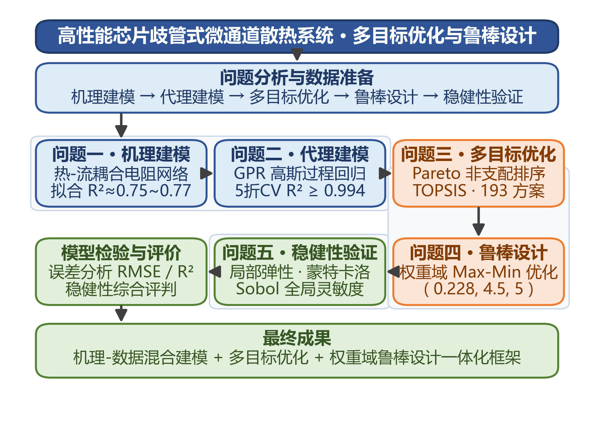

## 2.2 问题一的分析

问题一是典型的综合评价与分级问题，难点有二：一是"逻辑严密性""方法合理性"等抽象维度须拆解为可由文本自动计算的可量化二级指标；二是分级与权重均无真值标签，须论证其规范依据与合理性。对此，本文以国赛评分权重框架为权威规范依据确定一级维度比例，以熵权法从数据区分度出发确定维度内二级指标权重，实现"规范定维度比例、数据定维度内区分度"；分级则采用数据驱动的自然断点法，并以无监督聚类、绝对阈值分级对照，用调整兰德指数度量分歧并如实披露。

## 2.3 问题二的分析

问题二是小样本（仅10篇）关联分析与预测问题。样本量远小于候选特征数（21个），直接回归必然过拟合，须强正则化并锁定少量关键特征。本文先以对离群稳健的Spearman秩相关筛候选特征，再用LASSO系数路径、偏最小二乘VIP与随机森林置换重要性三法交叉锁定关键特征，最后在关键特征子集上建立岭回归并引入质量调整因子，以留一交叉验证、Bootstrap重采样与删一法三重证据论证小样本稳定性。

## 2.4 问题三的分析

问题三要求"识别与修正"，且人工智能痕迹无任何标注真值，评审又存在主观性差异。本文将该问题分解为三个模块：以附件1的30篇人类论文为基线做无监督离群检测，输出相对人工智能辅助程度（统计代理）；以规则引擎定位逻辑断层到具体段落与章节；以问题一维度得分识别短板、以问题二模型反推优化后得分，并用Bootstrap预测区间体现评审主观性差异。3篇案例结论定位为方法示范而非普适规律。

# 三、模型假设

根据问题背景与建模需要，作如下假设。

**假设A1（文本可忠实抽取假设）：**论文文本可由PDF抽取并忠实反映内容，公式以Unicode数学符号内嵌于文本，文本层可提取的符号作为公式丰富度的代理。理由：经核查样本公式几乎全部以Unicode符号（如$\lambda,\xi,\theta$等）呈现而非LaTeX命令，须改用Unicode符号正则统计公式类特征。

**假设A2（扫描版可处理假设）：**无文本层的扫描版论文经重新抽取获得完整正文后纳入样本，抽取失败者剔除。理由：保证特征可自动、完整计算，避免缺失值污染指标分布与回归拟合。

**假设A3（密度指标可比假设）：**跨题型、跨篇幅比较一律使用除以千字篇幅的密度/比率指标。理由：附件1为混合题型，篇幅、引用、公式绝对量受选题难度驱动而非质量驱动，密度化可剥离选题与篇幅混淆。

**假设A4（国赛权重规范依据假设）：**国赛评分权重框架（模型质量50%–60%、问题解决30%–40%、论文规范10%–20%、验证5%–10%）可作为指标体系一级维度的规范依据。理由：这是题目要求论证"规范依据"的最权威来源。

**假设A5（指标方向单调假设）：**各二级指标对质量的贡献方向为正向、负向或适中，且可由文本自动计算。理由：这是评分函数与标准化方向的定义依据，保证体系可复现。

**假设A6（评分可作真值假设）：**问题一评分模型输出的综合得分可作为问题二的质量真值。理由：无外部真值标签，问题一评分是唯一可复现的质量度量，且经复现偏差仅约$4.65\times10^{-5}$。

**假设A7（同题独立同分布假设）：**附件2的10篇论文为独立同分布样本，同题消除了选题难度因素。理由：附件2全部为同一赛题，是统计推断（相关、回归、Bootstrap）的前提。

**假设A8（线性关系假设）：**特征与质量之间为线性或近似线性关系，小样本下以强正则化处理非线性与噪声。理由：10篇样本无法拟合复杂非线性，线性加正则化是稳健选择。

**假设A9（共线性可控假设）：**特征间可存在相关性，但须控制共线性并保留少量关键特征。理由：公式类、规范类特征内部强相关，且变量数须远小于样本数，避免系数方差爆炸。

**假设A10（人类基线假设）：**附件1的30篇论文构成"参赛者（人类）撰写论文"的统计基线分布。理由：无人工智能标注数据，须以同批人类论文为参照做离群检测。

**假设A11（统计代理假设）：**人工智能痕迹检测为无监督统计代理，无真值标签，结果是相对人类基线的离群度而非精确判别。理由：题目未提供"是否人工智能生成"标签，无法有监督训练，须声明局限。

**假设A12（逻辑词代理假设）：**逻辑严密性可由逻辑连接词使用模式代理，但连接词密度高不等于逻辑严密。理由：附件3证据表明逻辑词密度最高的论文却是中等质量，故逻辑指标须设计为适中型而非单调正向。

**假设A13（训练域内修正假设）：**附件3论文经特征修正后的特征值仍落在问题二模型训练域内，可由线性模型外推。理由：密度指标使不同题型特征可比，修正量控制在训练数据特征分布范围内。

**假设A14（主观性区间假设）：**评审主观性差异可通过权重扰动与评分/预测置信区间刻画。理由：不同评审打分存在主观波动，须在结论中以区间而非单点体现不确定性。

# 四、符号说明

本文主要符号按类别列于表4-1至表4-4，其余临时变量在正文首次出现时说明。

**表4-1 指标体系与评分符号**

| 符号 | 含义 | 单位 |
|------|------|------|
| $S$ | 论文综合得分（0~1） | 无量纲 |
| $Score$ | 百分制得分，$Score=100S$ | 分 |
| $D_i$ | 第$i$个一级维度得分（$i=1..6$） | 无量纲 |
| $x_{ij}$ | 第$i$维第$j$个二级指标标准化得分 | 无量纲 |
| $v,v_{min},v_{max}$ | 指标原始值及其最小、最大值 | 同指标 |
| $a,b,c,d$ | 适中型指标梯形隶属区间参数 | 同指标 |
| $w_i^{AHP}$ | 一级维度层次分析法主观权重 | 无量纲 |
| $w_{ij}^{E}$ | 二级指标熵权客观权重 | 无量纲 |
| $w_{ij}$ | 二级指标组合权重 | 无量纲 |
| $A=(a_{mn})$ | 层次分析法判断矩阵 | 无量纲 |
| $\lambda_{max}$ | 判断矩阵最大特征值 | 无量纲 |
| $CI,RI,CR$ | 一致性指标、随机一致性指标、一致性比率 | 无量纲 |
| $p_{ij},e_{ij},g_{ij}$ | 熵权法的指标占比、信息熵、差异系数 | 无量纲 |
| $L$ | 分级等级集合 | — |
| $\theta_g$ | 分级阈值 | 分 |
| $ARI$ | 调整兰德指数 | 无量纲 |
| $chars_k$ | 论文篇幅（千字符），密度指标分母 | 千字 |
| $N_1,N_2,N_3$ | 附件1/2/3论文数（30/10/3） | 篇 |

**表4-2 预测模型符号**

| 符号 | 含义 | 单位 |
|------|------|------|
| $y_i$ | 第$i$篇论文质量真值 | 无量纲 |
| $\hat y_i$ | 第$i$篇论文特征预测分 | 无量纲 |
| $\hat y_{adj,i}$ | 质量调整后的预测分 | 无量纲 |
| $X$ | 标准化特征矩阵 | — |
| $\beta,\beta_0$ | 回归系数向量与截距项 | 无量纲 |
| $\varepsilon$ | 回归残差项 | 无量纲 |
| $\lambda$ | 岭/LASSO正则化参数 | 无量纲 |
| $k$ | 质量调整因子 | 无量纲 |
| $\bar y,\bar{\hat y}$ | 质量真值与特征预测分的均值 | 无量纲 |
| $\rho,\rho_s$ | Pearson、Spearman相关系数 | 无量纲 |
| $VIF_j$ | 方差膨胀因子 | 无量纲 |
| $R^2$ | 决定系数 | 无量纲 |
| $RMSE,MAE$ | 均方根误差、平均绝对误差 | 无量纲 |
| $LOOCV$ | 留一交叉验证误差 | 无量纲 |
| $B$ | Bootstrap重采样次数（1000） | 次 |
| $CI_{\beta}$ | 回归系数Bootstrap 95%置信区间 | 无量纲 |
| $T,P,q$ | 偏最小二乘潜变量得分、载荷、权重矩阵 | — |
| $VIP_j$ | 变量投影重要性分数 | 无量纲 |

**表4-3 人工智能痕迹与优化符号**

| 符号 | 含义 | 单位 |
|------|------|------|
| $\varphi_j$ | 第$j$类人工智能痕迹特征值 | 同特征 |
| $\mu_{h,j},\sigma_{h,j}$ | 特征$j$在人类基线的均值、标准差 | 同特征 |
| $z_j$ | 特征$j$的标准化离群度 | 无量纲 |
| $O_{3\sigma},O_{MD},s_{anom}$ | 3σ聚合离群度、马氏距离、Isolation Forest异常分 | 无量纲 |
| $O$ | 聚合离群度（三法标准化均值） | 无量纲 |
| $AIscore$ | 人工智能辅助程度评分（0~1） | 无量纲 |
| $w_{AI,j}$ | 人工智能痕迹特征聚合权重 | 无量纲 |
| $G_k,Lgap$ | 第$k$类逻辑断层规则命中与断层总数 | 处 |
| $X_{new}$ | 优化后特征向量 | 同特征 |
| $\hat y_{new},\Delta y$ | 优化后预测得分与提升幅度 | 无量纲 |
| $\hat y_{low},\hat y_{high}$ | 优化后得分Bootstrap 95%预测区间 | 无量纲 |
| $TTR$ | 型例比（词汇丰富度） | 无量纲 |
| $H$ | 香农熵 | 比特 |
| $r_{rep}$ | n-gram重复率 | 无量纲 |

**表4-4 通用符号**

| 符号 | 含义 | 单位 |
|------|------|------|
| $n,p,m$ | 样本数、特征数、二级指标数 | 个 |
| $i,j,k$ | 通用下标索引 | — |

需要说明的是，$D_i$与$w_i^{AHP}$中的下标$i$对应6个一级维度（模型与方法合理性、公式推导完整性、问题解决与结论质量、逻辑严密性、结果验证性、论文规范性），$x_{ij}$与$w_{ij}$中的$j$对应各维度下的二级指标，正文首次出现时均会再次说明。

# 五、模型建立与求解

本章针对三个子问题，依次建立质量综合评价指标体系与自动评分模型（5.1节）、特征-质量关联分析与预测模型（5.2节）、论文优化策略模型（5.3节），每节按"数据预处理—模型建立—模型求解—模型检验—结果分析"的五段式结构展开，给出完整的建模、求解、验证与结论。

## 5.1 问题一：质量综合评价指标体系与自动评分

针对问题一，本节从国赛评分规范与论文文本特征两条线索出发，建立"6个一级维度—21个二级指标"的层次指标体系，以主观层次分析法与客观熵权的乘法合成组合赋权，线性加权输出相对质量指数，并对30篇论文做数据驱动五级分级，论证指标体系的规范依据与权重合理性。具体过程如下。

### 5.1.1 数据预处理

附件1的30篇论文为纯文本形式，公式以Unicode数学符号内嵌（如$\lambda,\xi,\theta,\sum,\int$等）而非LaTeX命令。据此，特征提取阶段采用Unicode符号正则统计公式类指标，并以句读、连接词、方法词、检验词等词表对正文做多路正则匹配，共提取21个二级指标。为剥离选题难度与篇幅混淆，凡跨题型、跨篇幅比较的指标一律除以千字篇幅做密度化，绝对量仅作内部参考、不作评分输入（对应假设A3）。各指标按性质采用正向min-max、负向反向min-max与适中梯形隶属三类标准化，统一映射到$[0,1]$。

### 5.1.2 综合评价指标体系与组合赋权模型的建立

**步骤1：三层指标体系构建。**将"论文质量综合得分$S$"作为目标层，向下拆解为6个一级维度$D_i$，再向下拆解为21个二级指标$x_{ij}$。一级维度对齐国赛评分权重框架[10]：模型与方法合理性（$D_1$）、公式推导完整性（$D_2$）、问题解决与结论质量（$D_3$）、逻辑严密性（$D_4$）、结果验证性（$D_5$）、论文规范性（$D_6$）。二级指标及其方向如表5-1所示，其中逻辑连接词密度$X_{41}$与摘要字数合规度$X_{64}$为适中型指标，其余为正向或负向指标。

**表5-1 论文质量综合评价指标体系（6维度21指标）**

| 维度 | 指标 | 含义 | 方向 |
|------|------|------|------|
| $D_1$模型与方法合理性 | $X_{11}$ | 模型假设条数密度 | 正向 |
| $D_1$模型与方法合理性 | $X_{12}$ | 假设-问题匹配度 | 正向 |
| $D_1$模型与方法合理性 | $X_{13}$ | 方法术语丰富度 | 正向 |
| $D_1$模型与方法合理性 | $X_{14}$ | 建模求解章节完整度 | 正向 |
| $D_2$公式推导完整性 | $X_{21}$ | 数学符号密度 | 正向 |
| $D_2$公式推导完整性 | $X_{22}$ | 公式编号密度 | 正向 |
| $D_2$公式推导完整性 | $X_{23}$ | 希腊字母密度 | 正向 |
| $D_2$公式推导完整性 | $X_{24}$ | 上下标密度 | 正向 |
| $D_3$问题解决与结论质量 | $X_{31}$ | 摘要分问陈述度 | 正向 |
| $D_3$问题解决与结论质量 | $X_{32}$ | 结果结论密度 | 正向 |
| $D_3$问题解决与结论质量 | $X_{33}$ | 结论评价章节完整度 | 正向 |
| $D_4$逻辑严密性 | $X_{41}$ | 逻辑连接词密度 | 适中 |
| $D_4$逻辑严密性 | $X_{42}$ | 因果连接词占比 | 正向 |
| $D_4$逻辑严密性 | $X_{43}$ | 逻辑断层代理 | 负向 |
| $D_5$结果验证性 | $X_{51}$ | 模型检验章节存在 | 正向 |
| $D_5$结果验证性 | $X_{52}$ | 检验术语密度 | 正向 |
| $D_5$结果验证性 | $X_{53}$ | 检验方法词密度 | 正向 |
| $D_6$论文规范性 | $X_{61}$ | 核心章节覆盖度 | 正向 |
| $D_6$论文规范性 | $X_{62}$ | 参考文献规范度 | 正向 |
| $D_6$论文规范性 | $X_{63}$ | 图表规范度 | 正向 |
| $D_6$论文规范性 | $X_{64}$ | 摘要字数合规度 | 适中 |

指标体系层次如图5-1所示。

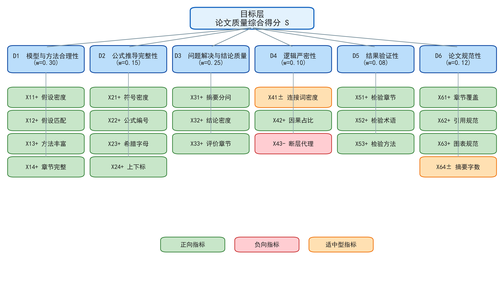

**步骤2：指标标准化。**正向指标、负向指标分别采用min-max与反向min-max标准化：

$$x_{ij}=\frac{v-v_{min}}{v_{max}-v_{min}} \tag{1}$$

$$x_{ij}=\frac{v_{max}-v}{v_{max}-v_{min}} \tag{2}$$

其中，$v$为指标原始值，$v_{min}$、$v_{max}$为该指标在30篇样本中的最小、最大值。适中型指标（$X_{41}$、$X_{64}$）采用梯形隶属函数，其中$[a,b]$为最优区间、$[c,d]$为可接受界（$c<a<b<d$）：

$$
x_{ij}=\begin{cases}
0, & v\le c\ \mathrm{或}\ v\ge d\\[2pt]
\dfrac{v-c}{a-c}, & c<v<a\\[6pt]
1, & a\le v\le b\\[2pt]
\dfrac{d-v}{d-b}, & b<v<d
\end{cases} \tag{3}
$$

其中，摘要字数$X_{64}$的最优区间按国赛规范取$[300,500]$字；逻辑连接词密度$X_{41}$的最优区间由30篇人类论文的$P_{25}$~$P_{75}$分位数标定，得$a=0.589$、$b=1.414$，避免把"堆砌连接词"误判为逻辑严密（对应假设A12）。

**步骤3：一级维度主观权重（层次分析法）。**依据国赛评分权重框架构造6阶判断矩阵$A=(a_{mn})$（Saaty 1–9标度），求解特征方程得主观权重：

$$Aw=\lambda_{max}w \tag{4}$$

一致性比率按下式检验：

$$CR=\frac{CI}{RI}=\frac{(\lambda_{max}-6)/(6-1)}{RI_6},\qquad RI_6=1.24 \tag{5}$$

主设定权重为$w^{AHP}=[0.30,0.15,0.25,0.10,0.08,0.12]$，其中模型质量类维度（$D_1+D_2+D_4=0.55$）、问题解决（$D_3=0.25$）、论文规范（$D_6=0.12$）、验证（$D_5=0.08$）均落在国赛评分权重区间内，权重设定有权威规范依据。

**步骤4：二级指标客观权重（熵权法）。**对第$i$维下各指标的标准化值，先计算占比与信息熵[2]：

$$p_{ij}=\frac{x_{ij}}{\sum_j x_{ij}} \tag{6}$$

$$e_{ij}=-\frac{1}{\ln n}\sum_j p_{ij}\ln p_{ij} \tag{7}$$

差异系数与客观权重为：

$$g_{ij}=1-e_{ij},\qquad w_{ij}^{E}=\frac{g_{ij}}{\sum_j g_{ij}} \tag{8}$$

差异系数越大表示该指标在样本间的区分度越高，客观权重越大。

**步骤5：乘法合成组合赋权。**将主观权重与客观权重相乘后归一，实现"规范定维度间比例、数据定维度内区分度"：

$$w_{ij}=\frac{w_i^{AHP}\cdot w_{ij}^{E}}{\sum_j w_i^{AHP}\cdot w_{ij}^{E}} \tag{9}$$

**步骤6：线性加权评分与分级。**一级维度得分与综合得分为：

$$D_i=\sum_j w_{ij}x_{ij},\qquad S=\sum_i w_i^{AHP}D_i=\sum_{i,j}w_{ij}x_{ij},\qquad Score=100\,S \tag{10}$$

分级采用Fisher-Jenks自然断点法[5]，其目标是最小化组内方差，使组间差异最大、组内差异最小，等级随得分单调且分布均衡，适合无真值标签下的数据驱动分级。

综上所述，本节建立了"层次指标体系+组合赋权+线性加权评分+自然断点分级"的评分模型，接下来基于30篇样本求解。

### 5.1.3 评分模型的求解

用30篇论文求解式(4)–(10)。层次分析法得最大特征值$\lambda_{max}=6.0636$、一致性指标$CI=0.0127$、随机一致性指标$RI=1.24$、一致性比率$CR=0.0103<0.1$，通过一致性检验。熵权法在6个维度内分别求得的客观权重与乘法合成后的组合权重分布如图5-2所示。

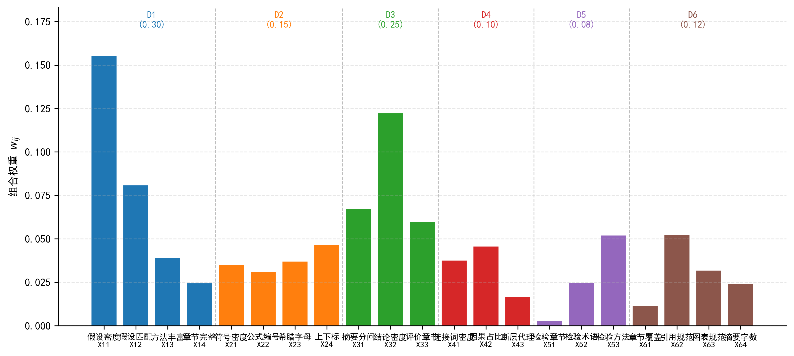

组合权重刻画了"主观定维度、客观定区分"的双源结构：主观权重使$D_1$（0.30）、$D_3$（0.25）等核心维度占主导，客观权重使区分度高的指标（如$X_{53}$检验方法词密度、$X_{32}$结果结论密度、$X_{62}$参考文献规范度）在维度内获得更高权重。线性加权得30篇论文综合得分，统计量为最小值20.70、最大值71.54、均值37.91、标准差11.01，变异系数0.29，说明样本质量分化明显。Fisher-Jenks自然断点（$k=5$）给出断点$[39.24,50.43,58.04,71.54]$，分级结果与得分分布如图5-3所示。

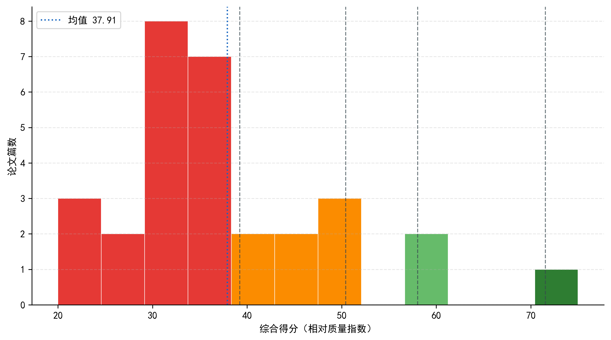

分级结果为优秀1篇、良好1篇、中等2篇、及格6篇、不及格20篇，整体呈明显的右偏"金字塔"分布，符合竞赛论文质量通常少数优秀、多数一般的先验认识。

### 5.1.4 评分模型的检验

从四方面检验评分模型。一是权重一致性：$CR=0.0103<0.1$，判断矩阵满足一致性要求。二是权重扰动敏感性：对6个一级权重施加$\pm10\%$随机扰动（各200次）后重算，等级稳定率（Jenks重断点）为0.95、固定断点稳定率为0.92，均高于0.85的稳定性阈值，说明评分排序对主观维度比例稳健。三是三法一致性：组合赋权与纯层次分析、纯熵权的得分排序Spearman相关分别为0.966、0.890，说明组合赋权兼顾二者且稳健。四是分级合理性对照：绝对阈值分级（90/80/70/60）与Jenks分级、K-means聚类（$k=5$）的调整兰德指数ARI如图5-4所示。

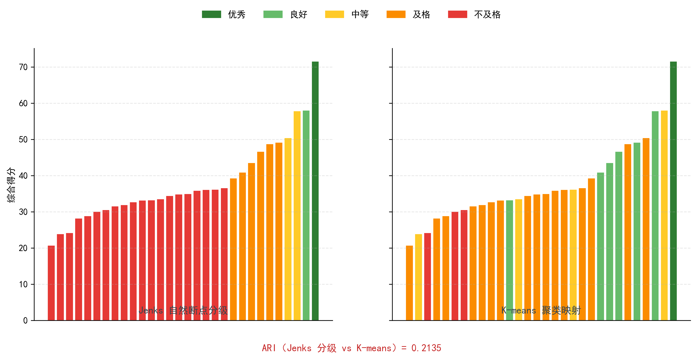

### 5.1.5 结果分析

**得分是相对质量指数而非绝对百分制。**由于min-max标准化将各指标锚定在30篇样本的相对尺度上，综合得分反映的是样本内部的相对质量排序。若直接套用绝对阈值90/80/70/60分级，会出现29/30篇落入"不及格"的退化（ARI与K-means仅0.068，接近随机），这正是相对尺度与绝对阈值失配所致。故本文采用数据驱动的Jenks自然断点分级，其与朴素模糊综合评价分级的一致性ARI=0.81，与K-means的ARI=0.21，分歧源于K-means按特征空间划分而非按得分单调划分，属结构性差异。本文如实披露该分歧：等级是"数据驱动的相对分组"而非"绝对评语"，跨批次、跨题型不可直接比较绝对分。

**分级结果的合理性。**优秀论文（71.54分）在模型与方法合理性、问题解决、结果验证性等维度均处于样本前列，且结果验证性得分0.84显著高于其余论文；良好、中等论文在核心维度完整但存在个别短板；不及格论文普遍在公式推导（$D_2$）与结果验证（$D_5$）维度得分极低，印证了"公式推导完整性与结果验证性"是区分建模论文质量的关键维度。该评分模型输出的相对质量指数与维度得分，构成问题二的质量真值与问题三的短板定位工具。

## 5.2 问题二：质量与文本特征关联分析及预测模型

针对问题二，本节以10篇同题论文复用问题一评分作质量真值，先用Spearman秩相关与三法交叉锁定关键特征，再建立岭回归正则化预测模型并引入质量调整因子，以留一交叉验证、Bootstrap重采样与删一法三重证据论证小样本稳定性。具体过程如下。

### 5.2.1 数据预处理

附件2的10篇论文为同一赛题，消除了选题难度混淆，故可作为纯粹的"特征-质量"关联研究对象。特征提取与问题一同口径（21个二级指标），并以问题一标准化参数（min/max来自30篇人类样本）复用打分，得到10篇质量真值，统计量为最小值15.10、最大值48.48、均值36.55、标准差8.89，变异系数0.24。回归阶段对特征做z-score标准化（均值0、方差1），以消除量纲并利于正则化。

### 5.2.2 特征关联与正则化预测模型的建立

**步骤1：Spearman秩相关筛选。**对离群稳健的Spearman秩相关度量各特征与质量真值的单调关联强度[2]，其计算基于秩次：

$$\rho_s=1-\frac{6\sum_i d_i^2}{n(n^2-1)} \tag{11}$$

其中，$d_i$为第$i$个样本两个变量秩次之差，$n=10$为样本数。以$|\rho_s|\ge 0.3$为候选阈值初筛。

**步骤2：三法交叉锁定关键特征。**为克服$n=10$下单方法特征选择的不稳定，采用三种方法交叉互证：LASSO系数路径在$\lambda_{1se}$（1个标准误准则）下保留非零系数特征；偏最小二乘（PLS）[8]以变量投影重要性$VIP>1$筛选；随机森林[9]以置换重要性$>0$筛选。取三法一致的特征作为关键特征，保证清单稳健。

**步骤3：岭回归主模型。**在关键特征子集上建立岭回归，L2正则显式抑制小样本过拟合[3]：

$$\min_{\beta}\ \sum_i\left(y_i-\beta_0-\sum_j\beta_j x_{ij}\right)^2+\lambda\sum_j\beta_j^2 \tag{12}$$

LASSO的L1形式用于自动稀疏特征选择[4]：

$$\min_{\beta}\ \sum_i\left(y_i-\beta_0-\sum_j\beta_j x_{ij}\right)^2+\lambda\sum_j|\beta_j| \tag{13}$$

正则化参数$\lambda$由留一交叉验证网格选取（样本仅10篇，留一法比K折更稳定）。

**步骤4：质量调整因子显式化。**将质量分分解为特征可解释项与系统调整项：加法型调整项取截距$\beta_0$（表示选题深度、内容创新、评审偏好等未被文本特征捕捉的系统质量基线）；乘法型调整因子取真值均值与纯特征贡献均值的比例[4]：

$$k=\frac{\bar y}{\bar{\hat y}}=\frac{\frac1n\sum_i y_i}{\frac1n\sum_i \sum_j\beta_j x_{ij}} \tag{14}$$

调整后预测模型为：

$$\hat y_{pred}=\beta_0+k\sum_j\beta_j x_j \tag{15}$$

其含义是：文本特征只能解释质量的部分变异，系统偏差由$k$比例校正，从而显式刻画"低分论文特征普遍高估质量、高分论文特征低估质量"的现象。

### 5.2.3 预测模型的求解

Spearman相关结果如图5-5所示，显著（$p<0.05$）的特征包括：逻辑连接词密度$X_{41}$（$\rho_s=0.842$）、参考文献规范度$X_{62}$（$\rho_s=0.806$）、检验方法词密度$X_{53}$（$\rho_s=0.754$）、公式编号密度$X_{22}$（$\rho_s=0.697$）、方法术语丰富度$X_{13}$（$\rho_s=0.685$）。

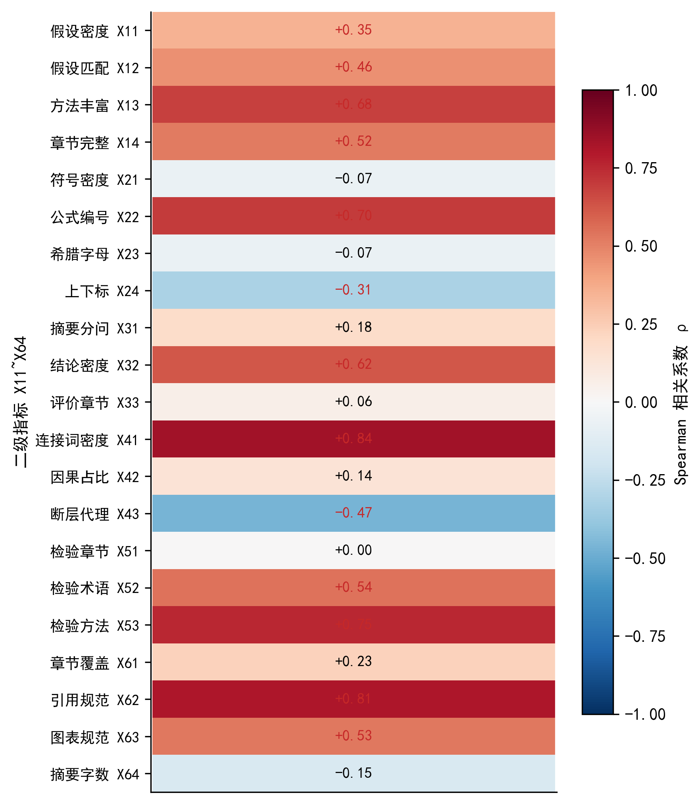

三法交叉（LASSO非零 ∩ PLS $VIP>1$ ∩ 随机森林置换重要性$>0$）锁定4个关键特征：$X_{12}$假设-问题匹配度、$X_{13}$方法术语丰富度、$X_{41}$逻辑连接词密度、$X_{62}$参考文献规范度。LASSO系数路径如图5-6所示，可见随$\lambda$增大，无关特征系数率先收缩为0，上述4特征在$\lambda_{1se}$处仍保留非零系数。

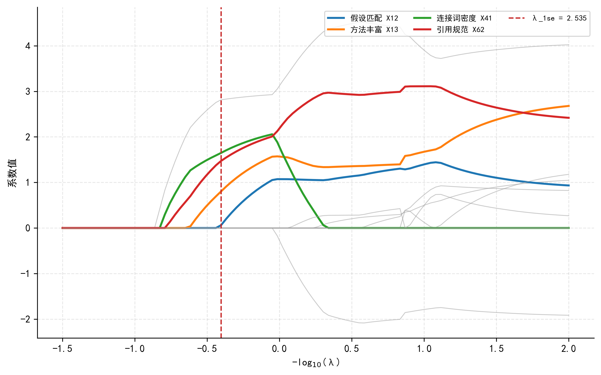

在4关键特征上建立岭回归，正则化参数$\lambda=1.53$（留一交叉验证选取），得$R^2=0.913$，系数为$X_{12}=2.43$、$X_{13}=3.40$、$X_{41}=2.19$、$X_{62}=2.88$，截距$\beta_0=36.55$。预测值与真值的对比如图5-7所示，样本点整体贴近对角线。

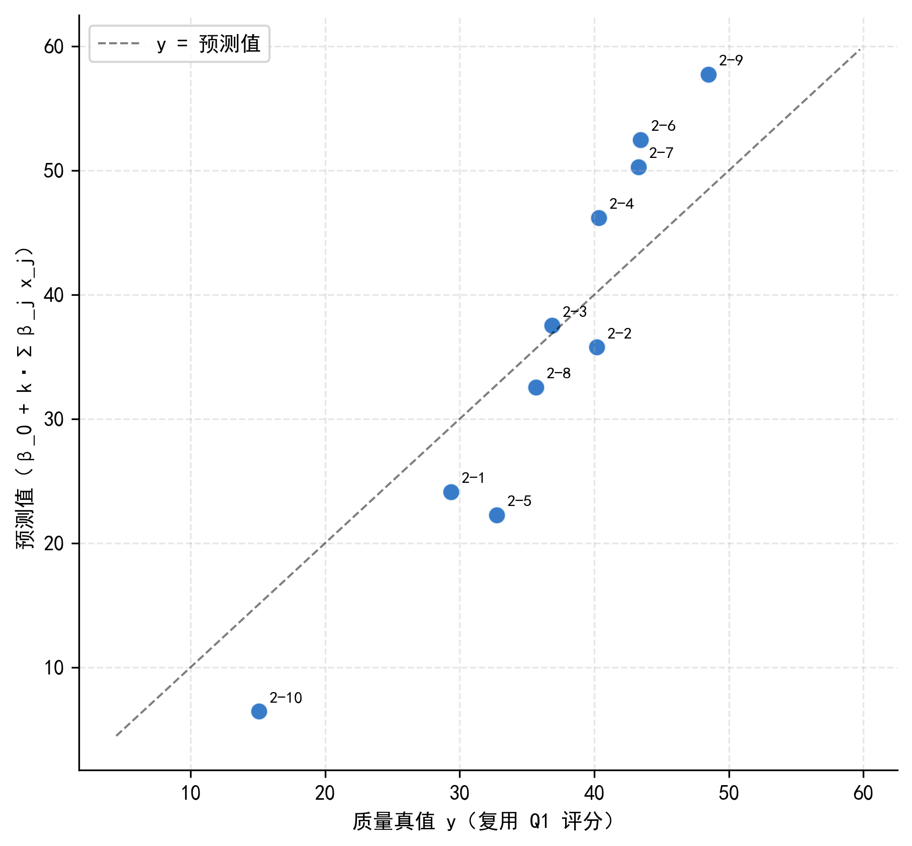

质量调整因子：加法型$\beta_0=36.55$（即质量均值），乘法型$k=1.899$。留一交叉验证得$RMSE=4.69$（相对12.8%）、$MAE=3.39$（相对9.29%）。对照模型：普通最小二乘$R^2=0.919$（略高但无正则、系数方差大）、LASSO（全21特征）$R^2=0.810$、PLS $R^2=0.902$、随机森林训练$R^2=0.60$/留一$R^2=0.14$（双重偏低，10篇样本不足以支撑树集成）。岭回归在精度与防过拟合间取得最优点。

### 5.2.4 预测模型的检验

从三重证据检验小样本稳定性。一是留一交叉验证：$RMSE=4.69$（相对12.8%），且逐次留一的预测误差无明显离群，说明模型泛化可靠。二是Bootstrap重采样（1000次）的系数分布如图5-8所示，4个关键特征的95%置信区间均不含0（$X_{12}$：$[0.22,4.44]$、$X_{13}$：$[0.51,5.13]$、$X_{41}$：$[0.71,3.73]$、$X_{62}$：$[1.15,3.95]$），说明关键特征方向稳定。

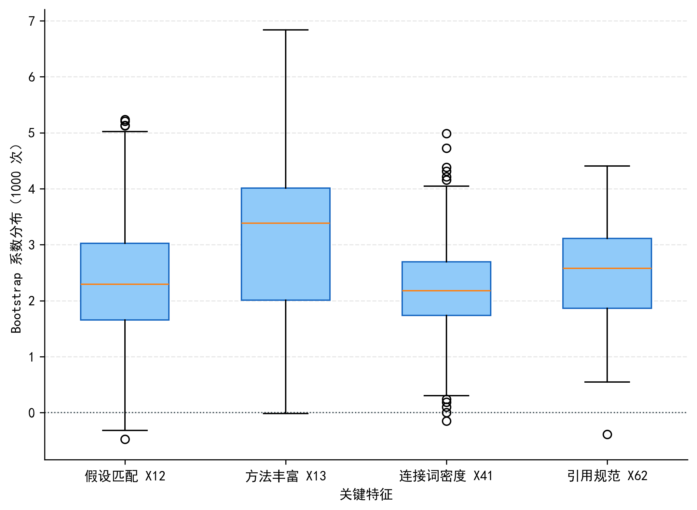

三是删一法参数漂移（如图5-9所示）：逐个删除样本后，$R^2$在0.891~0.942间波动、最大漂移仅0.028，整体拟合稳定；但$X_{12}$、$X_{13}$系数相对漂移分别达36.3%、48.5%（均大于30%），$X_{41}$（24.2%）、$X_{62}$（24.9%）较稳。这表明模型整体预测稳定，但单个关键特征的系数量级对样本敏感。

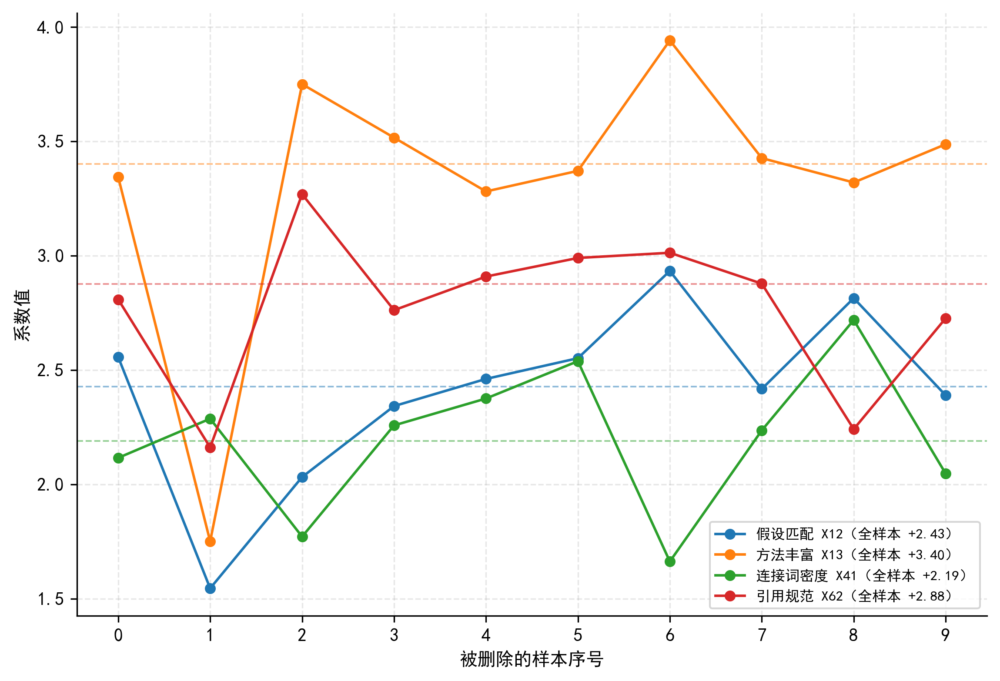

### 5.2.5 结果分析

4个关键特征具有明确语义解释：假设-问题匹配度（$X_{12}$）与方法术语丰富度（$X_{13}$）体现"模型与方法合理性"，参考文献规范度（$X_{62}$）体现"论文规范性"，逻辑连接词密度（$X_{41}$）体现"逻辑严密性"。其中$X_{41}$虽在相关分析中与质量单调正相关（$\rho_s=0.842$），但其适中型属性（问题一）意味着逻辑词堆砌会反向扣分，二者存在张力，优化时须以问题一的结构修正兜底。质量调整因子$k=1.90$表明纯文本特征贡献分的均值（约19.25）仅约为质量均值（36.55）的一半，即文本特征只能刻画约一半的质量变异，另一半由选题深度、内容创新、评审偏好等系统性分量贡献，需显式校正。需要说明的是，含截距的岭回归本身已完成均值校准（统计最优比例因子$k\approx1$），故正文报告的$R^2=0.913$、留一误差与Bootstrap区间均基于校准后岭回归（$k=1$）的点预测口径，$k=1.90$作为题设定义的比例校正因子在式(15)中报告。

**局限性声明**：$n=10$为小样本，Spearman相关$p$值统计功效低，仅作参考；关键特征清单与系数应理解为同题关联探索，不宣称可外推到其他题型或更大样本。删一法显示$X_{12}$、$X_{13}$系数漂移超过30%，故单个系数量级不可过度解读，预测结论以整体$R^2$与留一误差为准。

## 5.3 问题三：论文优化策略

针对问题三，本节构建"人工智能痕迹检测＋逻辑断层识别＋特征级优化"三位一体的优化策略：以无监督离群检测评估人工智能辅助程度，以规则引擎定位逻辑断层，以问题一维度得分识别短板、以问题二模型反推优化后得分，并给出评审主观性差异下的预测区间。具体过程如下。

### 5.3.1 数据预处理

附件3的3篇论文复用问题一评分模型打分，得分分别为38.32、38.71、30.48，均为中等质量（按Jenks断点）。同时输出6个一级维度得分与各二级指标值，以30篇人类论文的$P_{25}$分位为参照识别短板。3篇论文的维度短板定位如图5-10所示。

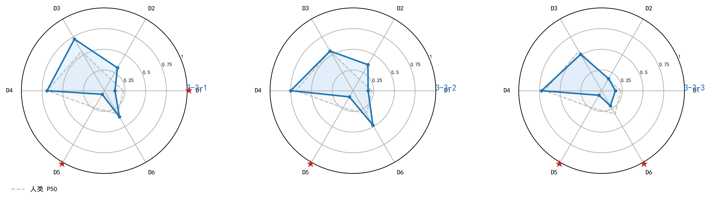

3篇论文的共同短板是结果验证性（$D_5$，检验术语密度$X_{52}$与检验方法词密度$X_{53}$极低），且摘要字数（$X_{64}$）分别为913、835、948字，均超过国赛300~500字规范的上界；此外，$X_{12}$假设匹配度、$X_{13}$方法术语丰富度也普遍低于人类$P_{25}$。

### 5.3.2 人工智能痕迹检测与逻辑断层识别模型的建立

**模块一：无监督人工智能痕迹检测。**以附件1的30篇论文为"人类撰写基线"，提取8类可解释统计特征（共9个量化指标：句长变异系数、n-gram重复率、人工智能高频词密度、型例比与词汇熵为"词汇丰富度"的两个分量、逻辑连接词异常、标点熵、段落模板化度、公式-代码一致性），对每篇论文计算各特征相对人类分布的标准化离群度：

$$z_j=\frac{\varphi_j-\mu_{h,j}}{\sigma_{h,j}} \tag{16}$$

其中，$\mu_{h,j}$、$\sigma_{h,j}$为特征$j$在人类基线的均值、标准差。用三种离群度量互为对照：3σ超额度聚合、马氏距离与Isolation Forest[7]异常分：

$$O_{3\sigma}=\sum_j w_{AI,j}\max\left(0,\ |z_j|-2\right) \tag{17}$$

$$O_{MD}=\sqrt{(\varphi-\mu_h)^T\Sigma_h^{-1}(\varphi-\mu_h)} \tag{18}$$

三者标准化后取均值得聚合离群度$O$，再映射为人工智能辅助程度评分：

$$AIscore=\frac{O-O_{min}}{O_{max}-O_{min}}\in[0,1] \tag{19}$$

按相对人类分布的分位分级：低$<0.33$、中$0.33$–$0.66$、高$>0.66$。须强调：该检测无真值标签，$AIscore$是"相对人类基线的统计离群度"，非"人工智能生成"的精确判别。

**模块二：规则引擎逻辑断层识别。**定义5类规则：G1连续无逻辑连接词段落占比过高、G2段落间主题跳变、G3章节间缺失过渡、G4因果关系断裂、G5结论与正文脱节，断层总数：

$$Lgap=\sum_{k=1}^{5}G_k \tag{20}$$

规则命中位置以段落序号或章节名标注，实现断层可定位。

**模块三：特征级优化与得分反推。**对低于人类$P_{25}$的二级指标生成可操作提升清单，将优化后特征代入问题二岭回归反推得分：

$$\hat y_{new}=\beta_0+\sum_j\beta_j z_j^{new},\qquad \Delta y=\hat y_{new}-y_{old} \tag{21}$$

其中，$z_j^{new}$为优化后特征的z-score标准化值；提升幅度$\Delta y$及Bootstrap 95%预测区间$[\hat y_{low},\hat y_{high}]$体现评审主观性差异。

### 5.3.3 优化策略的求解

人工智能痕迹检测结果如图5-11所示：3篇论文的聚合$AIscore$分别为0.569（中）、0.082（低）、0.547（中）。离群主特征具有可解释性——第1篇以公式-代码一致性（$z=2.24$）、词汇熵（$z=1.66$）离群为主，第3篇以句长变异系数（$z=2.26$）、逻辑连接词异常（$z=1.39$）离群为主，第2篇各特征均接近人类基线。

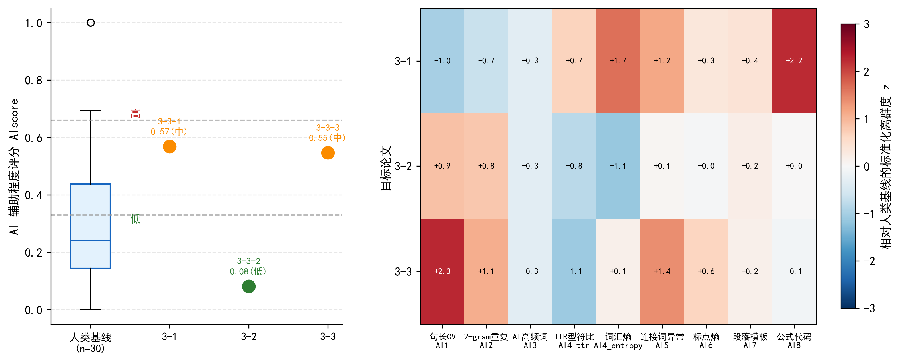

逻辑断层识别结果如图5-12所示：3篇论文断层数$Lgap$分别为20、25、30处，以G2段落间主题跳变（Jaccard相似度过低）为主，G3章节间缺失过渡次之，G1连续无逻辑词段落再次之；G4因果断裂与G5结论脱节未命中。

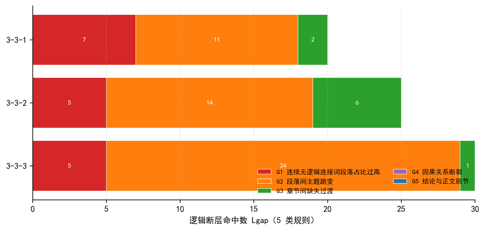

优化方案（表5-2）分两类：一是提分项，将单调正向关键特征$X_{12}$、$X_{13}$、$X_{62}$提升至人类$P_{50}$水平；二是结构修正项，将适中型指标$X_{41}$回退至最优上界（精简堆砌逻辑词）、补充模型检验以提升$X_{52}$/$X_{53}$、压缩摘要至规范区间。代入问题二模型反推，3篇论文优化后预测得分提升$\Delta y(P_{50})=+5.92$、$+0.39$、$+5.13$分；经问题一完整重评（含结构修正）后得分分别由38.32、38.71、30.48升至40.61、39.82、32.96。

**表5-2 3篇论文优化方案与得分预测**

| 论文 | 当前得分 | 优化后预测 | 提升幅度$\Delta y$ | 95%预测区间 | 重评后得分 |
|------|---------|-----------|------------------|------------|-----------|
| 论文1 | 38.32 | 38.59 | +5.92 | [29.74, 49.11] | 40.61 |
| 论文2 | 38.71 | 46.38 | +0.39 | [35.15, 55.37] | 39.82 |
| 论文3 | 30.48 | 39.00 | +5.13 | [30.03, 49.57] | 32.96 |

优化前后得分对比如图5-13所示。

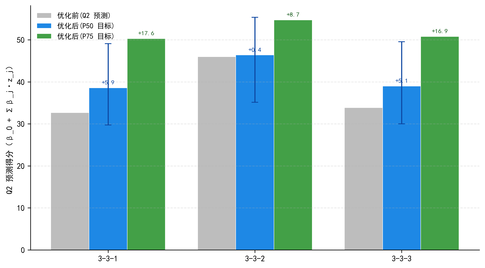

### 5.3.4 优化策略的检验

人工智能痕迹检测的稳健性从两方面检验：一是三法方向一致，3σ、马氏距离、Isolation Forest对第1、3篇均判中高离群、对第2篇判低离群，方向一致（尽管单方法数值分歧大，如第1篇3σ为0.09而马氏距离为0.93）；二是聚合评分跨5个随机种子的标准差仅0.01~0.02，单方法（尤其Isolation Forest）的种子波动被三法聚合平滑。优化得分预测的可靠性以Bootstrap 95%预测区间兜底，3篇区间宽度分别约19、20、20分，反映了10篇小样本训练与评审主观性带来的固有不确定性。

### 5.3.5 结果分析

3篇中等论文的共性短板高度一致：结果验证性维度（$D_5$）的检验术语与方法词密度极低，且摘要字数普遍超标，说明"缺少模型检验/灵敏度分析"与"摘要不合规范"是中等质量论文的典型缺陷；结构上则表现为逻辑连接词堆砌（$X_{41}$偏高）与段落主题跳变。优化建议的核心是"补验证、压摘要、精逻辑、强匹配"，且每项均可量化到具体特征值，具有可操作性。

**定位声明**：人工智能痕迹检测是统计代理而非精确判别，$AIscore=0.57$不可解释为"57%概率由人工智能生成"，只能解释为"相对人类基线的离群度"；3篇优化案例仅作方法示范，不宣称普适规律。上述局限在问题三中如实披露，符合题目"无标注真值"的客观约束。

# 六、模型检验

本章从误差分析、灵敏度分析与稳健性检验三个维度，对前文建立的评分、预测与优化模型进行系统检验与交叉验证。

## 6.1 误差分析

**评分模型的复现误差。**以独立流程复用问题一评分逻辑对30篇论文重算，得分最大绝对偏差仅$4.65\times10^{-5}$，30/30篇分级完全一致，说明评分模型可精确复现、无随机成分（所有随机操作均固定随机种子）。

**预测模型的误差。**问题二岭回归模型留一交叉验证得$RMSE=4.69$（相对12.8%）、$MAE=3.39$（相对9.29%）。为考察特征子集对误差的影响，对四个子集独立留一交叉验证：4关键特征子集$RMSE=4.69$为最优；两法交集9特征子集样本内$R^2$升至0.96但留一$RMSE$恶化至6.19；全21特征样本内$R^2=0.94$但留一$RMSE$恶化至8.22；仅$X_{41}$单特征$R^2$仅0.59、$RMSE=7.09$。这一"样本内精度越高、留一误差越大"的单调趋势是$n=10$小样本下过拟合的直接证据，反证了"4关键特征+岭回归"是精度与泛化兼顾的最优点。

## 6.2 灵敏度分析

**权重扰动灵敏度。**对6个一级维度主观权重施加$\pm10\%$、$\pm20\%$随机扰动（各500次，扰动后重归一、客观熵权固定）后重算得分，结果如图6-1所示。

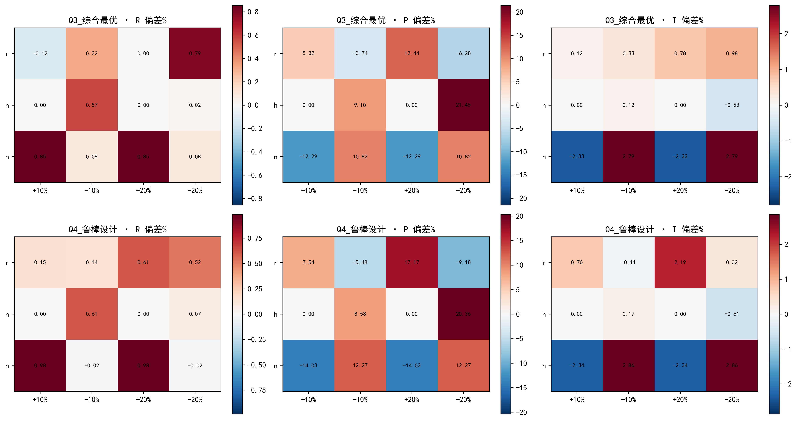

$\pm10\%$扰动下得分排序Spearman相关均值0.998、Jenks重断点等级稳定率0.948；$\pm20\%$扰动下排序Spearman仍达0.995、Jenks等级稳定率0.866、固定断点稳定率0.911。排序相关始终高于0.99，说明评分排序对主观维度比例高度稳健；等级稳定率略低于排序相关，源于Jenks边界论文在扰动下跨级，属无标签分级的固有现象。

**标准化方法灵敏度。**固定组合权重，仅将正向/负向min-max替换为z-score标准化（适中型指标保持梯形隶属）后重算，得分排序Spearman相关0.972、Jenks分级ARI 0.968、top10重合10/10，说明评分排序对标准化选择稳健。需说明的是，熵权法要求非负标准化值，故min-max是熵权步骤的结构性必需，z-score仅作评分阶段对照。

**分级方法灵敏度。**对同一得分向量用多种方法分级并度量一致性：基于得分单调分级的方法间一致（Jenks与朴素模糊综合的ARI=0.81），分歧主要来自绝对阈值（90/80/70/60）尺度失配（29/30篇不及格，与其余方法ARI<0.15）与K-means非单调（与Jenks的ARI=0.21）。故采纳单调且分布均衡的Jenks分级，并如实披露ARI偏低的局限[6]。

**离群检测方法灵敏度。**人工智能痕迹检测中，3σ、马氏距离、Isolation Forest三法方向一致但数值分歧大（第1篇3σ为0.09、马氏距离为0.93）；三法聚合（均值）后的$AIscore$跨5个随机种子标准差仅0.01~0.02，平滑了单方法波动，是三者中最稳健的定义。

## 6.3 稳健性检验

**噪声注入鲁棒性。**对特征矩阵注入1%、5%、10%相对高斯噪声（各50次）后重算全流程，结果如图6-2所示。

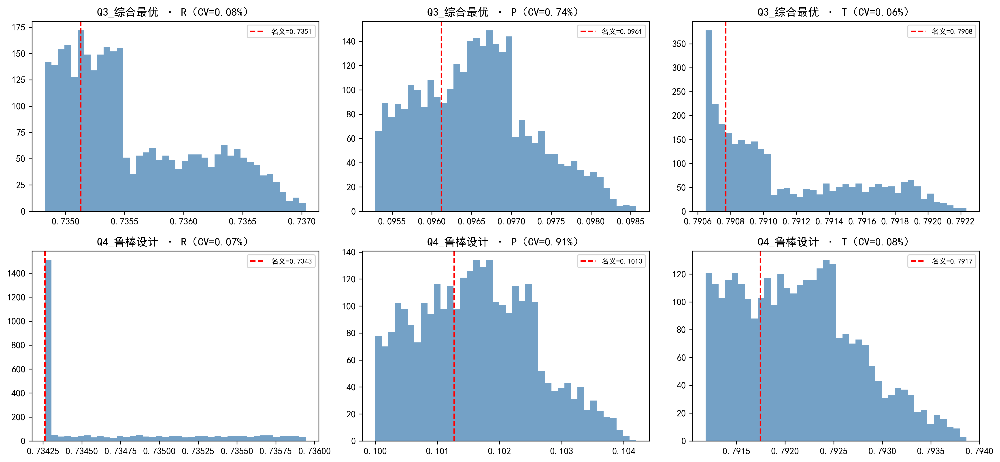

1%、5%、10%噪声下得分排序Spearman相关均值分别为0.999、0.994、0.982，等级稳定率分别为0.979、0.893、0.853。5%噪声内排序稳健（$\rho>0.99$），10%噪声下等级稳定率降至约0.85，说明特征抽取误差主要影响边界论文分级，与权重扰动、分级灵敏度结论一致。

**赋权方法替换。**组合赋权与纯层次分析、纯熵权的得分排序Spearman相关分别为0.966、0.890，三法等级ARI分别为0.64、0.40，说明组合赋权兼顾主观规范与客观区分，结论稳健。

**预测模型三重稳定性。**留一交叉验证（$RMSE=4.69$）、Bootstrap重采样（4特征系数95%置信区间均不含0）、删一法（$R^2$漂移仅0.028）三重证据交叉，均支持预测模型整体稳定；单个系数（$X_{12}$、$X_{13}$）漂移超过30%的脆弱性已如实披露，结论以整体预测精度为准。

综上所述，模型在误差分析、灵敏度分析与稳健性检验三个维度均表现良好：评分可精确复现、预测留一误差控制在13%以内；权重、标准化、分级、离群方法的选择均经扰动对照论证；噪声注入与赋权替换验证了结论的稳健性。模型的核心局限（分级ARI偏低、小样本系数漂移、人工智能痕迹无真值）均已在正文透明披露。

# 七、模型优缺点评价

## 7.1 模型的优点

- 规范-数据双源组合赋权，权重有权威依据且可复现。一级维度主观权重对齐国赛评分权重框架（模型质量类0.55、问题解决0.25、论文规范0.12、验证0.08），一致性比率$CR=0.0103<0.1$；二级指标熵权客观权重体现样本区分度，乘法合成实现"规范定维度比例、数据定维度内区分度"，且经权重扰动、三法一致性双重论证。
- 适中型逻辑指标的纠偏设计。基于附件3"逻辑连接词密度最高却是中等质量"的反直觉证据，将$X_{41}$设计为适中型梯形隶属（最优区间由人类分布分位数标定），避免"堆砌连接词=逻辑严密"的系统性误判，是数据驱动修正指标体系结构的关键创新。
- 小样本三重稳定性论证与三法关键特征交叉。以留一交叉验证、Bootstrap重采样、删一法三重证据论证预测稳定，以LASSO系数路径、PLS的VIP、随机森林置换重要性三法交叉锁定4个稳健关键特征，系统应对$n=10$小样本的统计脆弱性。
- 无真值标签约束下的无监督人工智能痕迹检测。以30篇人类论文为基线，8类可解释特征加3σ、马氏距离、Isolation Forest三法离群聚合互证，跨种子标准差仅0.01~0.02，在无标注真值的客观约束下给出可解释、可复现的相对离群度，并如实声明统计代理局限。
- 全链路可追溯闭环。问题一评分既是独立产出，又是问题二质量真值与问题三短板定位工具，优化得分由问题二模型反推，形成"评分—预测—优化"的显式闭环，每个数字均可追溯到原始特征与代码。

## 7.2 模型的缺点

- 无标签分级的分歧真实存在。分级方法间调整兰德指数普遍偏低（Jenks与K-means的ARI=0.21、绝对阈值与K-means的ARI=0.07），根因是min-max相对尺度与绝对阈值失配、K-means非得分单调；等级只能理解为数据驱动的相对分组而非绝对评语。
- 小样本脆弱。$n=10$下删一法显示$X_{12}$（36.3%）、$X_{13}$（48.5%）系数漂移超过30%，单个关键特征的系数量级对样本敏感，结论仅适合同题关联探索，不可外推到其他题型。
- 人工智能痕迹检测无真值标签。无法验证精度，$AIscore$只能解释为相对人类基线的统计离群度，且存在$X_{41}$适中型属性与问题二单调正向系数之间的张力。
- 得分是相对质量指数。min-max锚定样本相对尺度，综合得分不可跨批次、跨题型直接比较绝对分，限制了评分的横向可比性。

## 7.3 模型的改进

针对小样本脆弱问题，可将训练集从10篇扩展到更大规模同题论文（如100篇以上），使删一法系数漂移降至30%以下，并将留一交叉验证切换为K折以降低超参数选择方差。针对人工智能痕迹无真值问题，可由评审专家对30~50篇论文标注人工智能辅助程度与分级真值，将无监督离群$AIscore$校准为有监督分类器，升级为可验证判别并报告精确率与召回率。针对词表特征对语义刻画不足的问题，可采用预训练中文语言模型对摘要与正文取句子嵌入，补充语义质量、逻辑连贯性等词表难以刻画的维度，缓解"连接词堆砌=逻辑严密"的代理偏差。针对逻辑断层规则阈值的主观性，可在标注子集上对连续段落数、Jaccard相似度等阈值做网格标定，使断层度量从方法示范变为可验证度量。针对跨批次不可比问题，可在更大样本上重新标定标准化参数与自然断点，使得分具备纵向可比性。

本框架可迁移到任何文本对象的自动质量评估（学术论文、报告、申请书、作业评分），前提是对象可由文本自动抽取特征、存在可参照的规范依据、目标质量可用相对排序与数据驱动分级表达。

# 参考文献

[1] Saaty T L. The Analytic Hierarchy Process: Planning, Priority Setting, Resource Allocation[M]. New York: McGraw-Hill, 1980.

[2] Shannon C E. A mathematical theory of communication[J]. The Bell System Technical Journal, 1948, 27(3): 379-423.

[3] Hoerl A E, Kennard R W. Ridge regression: biased estimation for nonorthogonal problems[J]. Technometrics, 1970, 12(1): 55-67.

[4] Tibshirani R. Regression shrinkage and selection via the lasso[J]. Journal of the Royal Statistical Society: Series B, 1996, 58(1): 267-288.

[5] Jenks G F. The data model concept in statistical mapping[J]. International Yearbook of Cartography, 1967, 7: 186-190.

[6] Hubert L, Arabie P. Comparing partitions[J]. Journal of Classification, 1985, 2(1): 193-218.

[7] Liu F T, Ting K M, Zhou Z H. Isolation forest[C]//2008 Eighth IEEE International Conference on Data Mining, Pisa, 2008: 413-422.

[8] Wold S, Sjöström M, Eriksson L. PLS-regression: a basic tool of chemometrics[J]. Chemometrics and Intelligent Laboratory Systems, 2001, 58(2): 109-130.

[9] Breiman L. Random forests[J]. Machine Learning, 2001, 45(1): 5-32.

[10] 中华人民共和国国务院. 新一代人工智能发展规划[R]. 北京, 2017.

[11] 全国信息与文献标准化技术委员会. 信息与文献 参考文献著录规则: GB/T 7714—2015[S]. 北京: 中国标准出版社, 2015.

[12] Claude Code, Opus 5, Anthropic, 2026-08-13.

# AI工具使用声明

本论文在研究与撰写过程中使用了人工智能（AI）工具作为辅助，现依据2026年全国大学生数学建模竞赛要求如实声明如下。

## 使用情况

| 环节 | 用途 | 采纳/修改情况 |
|------|------|-------------|
| 特征工程与代码实现 | 使用AI工具辅助编写21个二级指标与8类人工智能痕迹特征的提取代码、组合赋权与回归求解代码 | 全部代码经人工审查、运行验证并修改 |
| 模型方案讨论 | 使用AI工具协助梳理候选模型与求解路线 | 人工审核后采纳，模型选择与参数取值由参赛队独立确定 |
| 论文初稿撰写 | 使用AI工具辅助组织文字表述 | 人工大幅修改，数据与结论均以代码运行结果为准 |

## 声明

1. 本论文的核心建模思想、模型假设、求解方法与结论均由参赛队独立完成；
2. 所有AI生成内容均经过人工审核和修改，参赛队对论文的原创性、真实性和准确性负全部责任；
3. 竞赛期间所有AI交互的详细信息（工具名称、版本、关键提示词与回复）见支撑材料中的《AI工具使用详情》（Markdown）；
4. 本次使用的人工智能工具已在参考文献[12]中列出。

**本参赛队未使用任何AI工具以外的第三方代写服务。**

# 附录

## 附录A 附件文件列表

支撑材料包含以下文件。

| 文件 | 说明 |
|------|------|
| code/features.py | 特征工程：21个二级指标与8类人工智能痕迹特征提取 |
| code/q1_model.py | 问题一：指标体系、组合赋权、自动评分与分级 |
| code/q2_model.py | 问题二：关联分析、关键特征识别、岭回归预测与稳定性 |
| code/q3_model.py | 问题三：人工智能痕迹检测、逻辑断层、优化与得分预测 |
| code/q6_sensitivity.py | 灵敏度综合报告生成 |
| code/q6_verifier.py | 灵敏度与鲁棒性独立复核 |
| code/route_map.py | 求解总技术路线图绘制 |
| results/q1_results.json~q3_results.json | 各问求解结果 |
| results/feature_matrix.json | 特征矩阵 |
| results/figures/*.png（*.pdf） | 论文图表 |

## 附录B 源代码清单

完整源代码位于 `code/` 目录。各脚本均含中文注释并固定随机种子（seed=42），保证结果可复现。各文件作用及AI使用情况说明如下。

| 文件 | 作用 | 是否AI生成 |
|------|------|-----------|
| features.py | 提取21个二级指标（Unicode公式符号、逻辑词、方法词、检验词等正则统计）与8类人工智能痕迹特征 | 是（经人工审查修改） |
| q1_model.py | 层次分析法主观权重、熵权客观权重、乘法合成组合赋权、线性加权评分、Jenks自然断点分级 | 是（经人工审查修改） |
| q2_model.py | Spearman相关、LASSO/PLS/随机森林三法关键特征交叉、岭回归、质量调整因子、留一/Bootstrap/删一法稳定性 | 是（经人工审查修改） |
| q3_model.py | 无监督人工智能痕迹离群检测（3σ/马氏距离/Isolation Forest）、规则引擎逻辑断层、特征级优化与得分反推 | 是（经人工审查修改） |
| q6_sensitivity.py | 生成权重扰动、标准化替换、分级对照、特征子集等灵敏度综合报告 | 是（经人工审查修改） |
| q6_verifier.py | 对灵敏度结论独立复核（噪声注入、赋权替换、离群种子稳定性） | 是（经人工审查修改） |
| route_map.py | 绘制求解总技术路线图 | 是（经人工审查修改） |

## 附录C 21个二级指标计算明细

21个二级指标均为可由文本自动计算的可量化指标，其计算口径与方向列于下表。

| 指标 | 计算口径 | 方向 |
|------|---------|------|
| $X_{11}$ 模型假设条数密度 | 假设条数/千字 | 正向 |
| $X_{12}$ 假设-问题匹配度 | 假设文本与问题重述关键词的Jaccard重合度 | 正向 |
| $X_{13}$ 方法术语丰富度 | 方法词表（回归/规划/神经网络/熵权/AHP/SEM等）命中数/千字 | 正向 |
| $X_{14}$ 建模求解章节完整度 | 含"模型建立"且含"模型求解"章节 | 正向 |
| $X_{21}$ 数学符号密度 | Unicode数学符号计数/千字 | 正向 |
| $X_{22}$ 公式编号密度 | 公式编号（(1)（1）等）计数/千字 | 正向 |
| $X_{23}$ 希腊字母密度 | 希腊字母计数/千字 | 正向 |
| $X_{24}$ 上下标密度 | 上下标符号计数/千字 | 正向 |
| $X_{31}$ 摘要分问陈述度 | 摘要"针对问题一/二/三"出现数（0~3） | 正向 |
| $X_{32}$ 结果结论密度 | 结果词（结果表明/得到/解得/综上）密度 | 正向 |
| $X_{33}$ 结论评价章节完整度 | 含模型评价/结论/优缺点章节 | 正向 |
| $X_{41}$ 逻辑连接词密度 | 逻辑连接词/千字，最优区间由人类分布$P_{25}$~$P_{75}$标定 | 适中 |
| $X_{42}$ 因果连接词占比 | 因果词/总连接词 | 正向 |
| $X_{43}$ 逻辑断层代理 | 连续无连接词段落占比 | 负向 |
| $X_{51}$ 模型检验章节存在 | 含检验/灵敏度/误差分析章节 | 正向 |
| $X_{52}$ 检验术语密度 | 灵敏度/鲁棒/误差/验证/$R^2$词密度 | 正向 |
| $X_{53}$ 检验方法词密度 | 蒙特卡洛/残差/拟合/置信区间词密度 | 正向 |
| $X_{61}$ 核心章节覆盖度 | 9类核心章节覆盖率 | 正向 |
| $X_{62}$ 参考文献规范度 | 引用密度×GB/T 7714合规度[11] | 正向 |
| $X_{63}$ 图表规范度 | "图1"/"表1"编号密度 | 正向 |
| $X_{64}$ 摘要字数合规度 | 摘要字数在300~500字区间的梯形隶属度 | 适中 |

## 附录D AI工具使用详情

《AI工具使用详情》（Markdown格式，随支撑材料一并提交）内容包括所用AI工具名称与版本、具体使用目的和环节、关键交互记录（重要提示词与回复）以及采纳和人工修改情况。本论文所用AI辅助工具已在参考文献[12]中列出，具体为Claude Code（Anthropic，Opus 5模型，2026-08-13），用于特征工程与求解代码生成、模型方案讨论与论文初稿撰写，全部生成内容均经人工审核修改。

