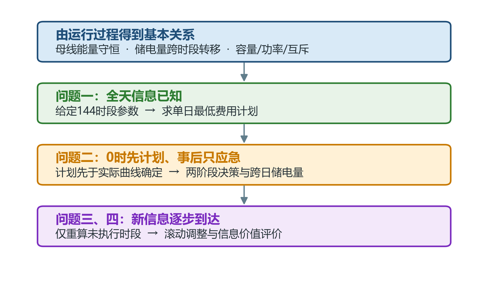
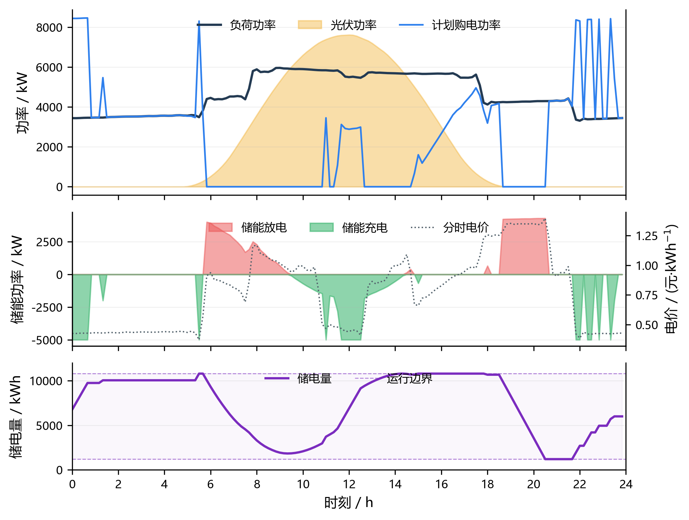
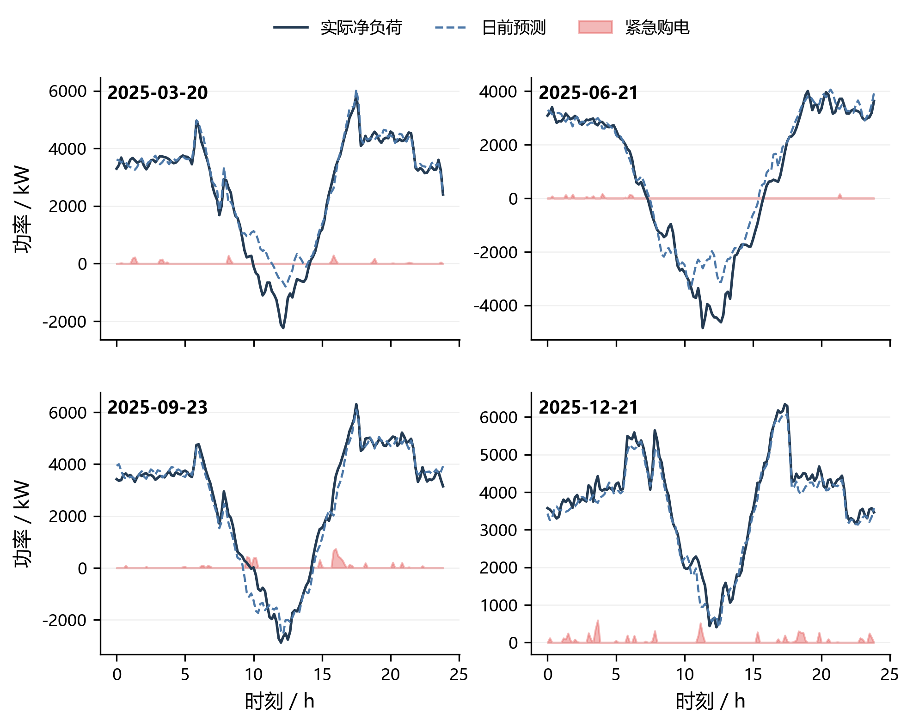
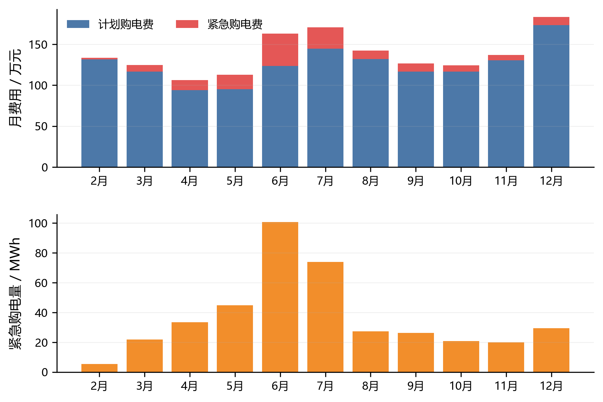
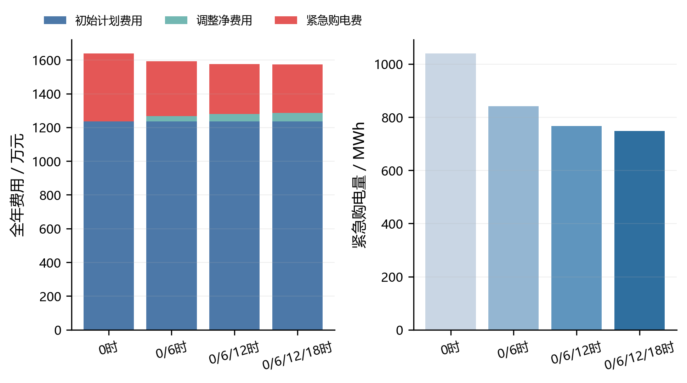
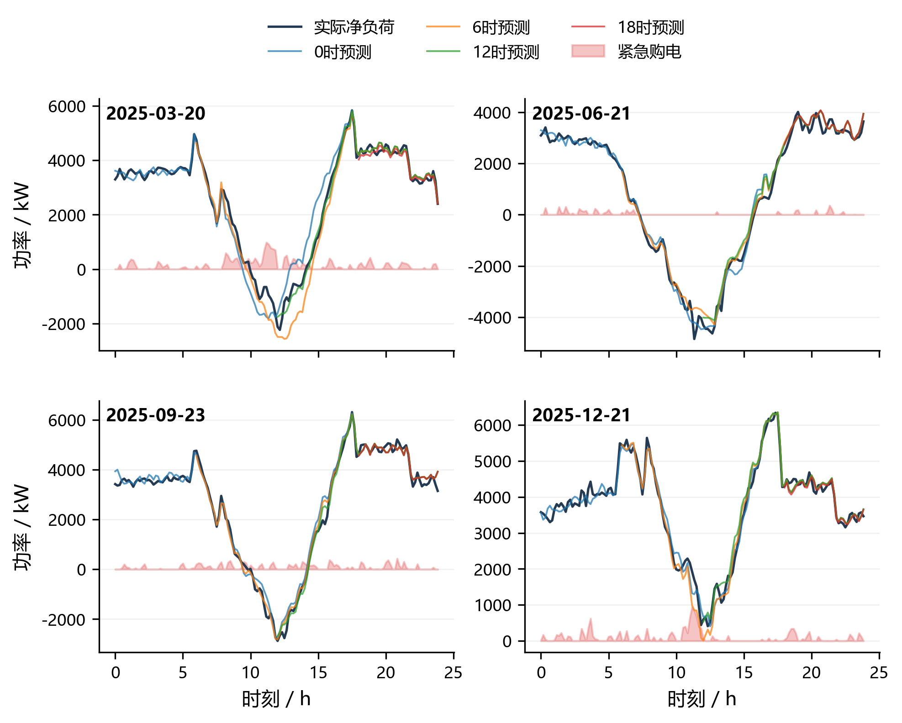
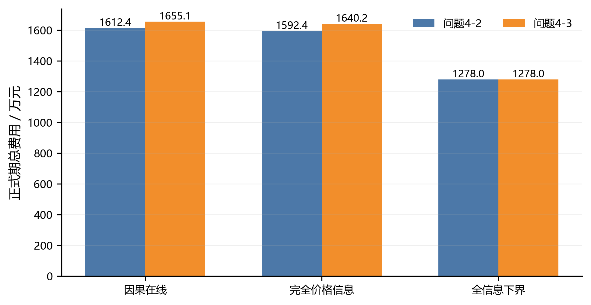

# 光伏微网中计及信息到达与非对称结算的储能—购电滚动优化

## 摘要

本文研究含光伏、储能和外网购电的居民微网运行问题。题目的核心不是简单确定“光伏、储能、外网”的固定供电顺序，而是在每个十分钟时段满足能量守恒，并利用储能把低价或富余光伏电量转移到更有价值的时段。由此，本文先从母线能量平衡和储能状态转移建立统一骨架，再依据四问中信息到达时刻与结算规则的变化逐层扩展模型。

对问题一，在价格、负荷和光伏均确定的条件下建立含充放电互斥状态的混合整数线性规划。模型所得日购电量为 **59 482.70 kWh**，日购电费用为 **35 126.95 元**，较无储能基线降低 **26.90%**；能量平衡和状态转移最大残差分别为 $2.27\times10^{-13}$ kWh 和 $8.31\times10^{-13}$ kWh。连续松弛与主模型在本实例上的目标值相同，但主模型仍保留互斥约束以排除其他数据条件下的非物理解。

对问题二，附件只给出实际负荷与实际光伏，不能在每日 0:00 预先读取。因此将每日决策拆为严格两阶段：第一阶段固定整日购电及充放电计划，第二阶段在实际曲线实现后只允许以 5 倍电价紧急购电，并将富余电量记为弃电。利用决策日前历史构造联合净负荷场景，以整日残差块保留时序相关，并用 48 小时延伸窗传递日末储能价值。正式期总费用为 **{{Q2_TOTAL_COST}} 元**，其中紧急购电 **{{Q2_EMERGENCY}} kWh**。

对问题三，0:00、6:00、12:00、18:00 的新光伏预报依次改变未执行时段的信息集，因而采用确定性 MILP-MPC。每次调整只作用于未来时段，增购按 $1.5p_t$、减购按上一版计划退回 $0.5p_t$，最终缺口仍按 $5p_t$ 结算。全年消融结果表明 **{{Q3_BEST_UPDATE_POLICY}}** 的总费用最低，说明 **{{Q3_UPDATE_CONCLUSION}}**。场景 MPC 与 CVaR-MPC 未在缺少稳定样本外增益的情况下进入主模型。

对问题四，实时价格的未来实现值在决策时不可见。本文以仅用历史价格的因果预测驱动 Q4-2 和 Q4-3，分别得到总费用 **{{Q42_COST}} 元**、**{{Q43_COST}} 元**；同时计算只放宽价格信息的反事实基准和全外生信息 oracle 严格下界，量化可获得信息的价值。全部结果均通过跨日 SOC、充放电互斥、费用账本和未来信息泄漏检查，并按附件 5 回填五份结果表。

**关键词：** 光伏微网；储能调度；两阶段随机规划；模型预测控制；因果预测；混合整数线性规划

## 1 问题重述

小区微网由光伏、储能、外网和负荷组成。光伏可以直接向负荷供电，也可以给储能充电；储能放电和外网购电共同弥补剩余缺口。题目给出 10 分钟粒度的电价、负荷、光伏数据，并规定储能额定容量为 12 000 kWh，允许运行区间为 1 200—10 800 kWh，最大充放电功率为 5 000 kW，充、放电效率均为 90%。

问题一要求在典型日曲线完全已知时确定计划购电量与储能策略，且 0:00 与 24:00 的储电量相同。问题二把负荷和光伏改为逐日变化的实际曲线，每日 0:00 制定全天计划，供电不足时按 5 倍电价紧急购电。问题三在每日 0:00、6:00、12:00、18:00 更新未来 24 小时光伏预测，并允许按非对称价格调整未执行的购电计划。问题四进一步把固定分时电价换为逐日实时波动价格，要求分别重算问题二和问题三。

## 2 问题分析与模型路线

### 2.1 模型为何从题目中自然产生

每个时段的电量有明确去向：外网购电、光伏发电和储能放电进入母线，负荷、储能充电和弃电离开母线；相邻时段只通过储电量连接。容量、功率和购电量均有线性边界，费用是购电量与单价的线性乘积，问题三的增减购电费用可以用正负差额拆成分段线性形式。因此，题目首先给出的是一个线性时序优化骨架；只有“同一套储能不能同时充放电”需要二元状态。采用 MILP 是物理结构的结果，而不是套用算法模板。储能 SOC 对微网经济调度的约束作用也与相关研究结论一致[1]。

### 2.2 四问之间的递进关系

| 问题 | 新增题干事实 | 数学含义 | 相应模型部件 |
|---|---|---|---|
| Q1 | 日曲线完全给定、首尾 SOC 相同 | 单日确定性闭环 | 确定性 MILP |
| Q2 | 0:00 决策、实际偏差 5 倍结算 | 决策与实现分离 | 严格两阶段随机 MILP |
| Q3 | 每 6 小时发布新光伏预测 | 信息集滚动、已执行决策冻结 | 确定性 MILP-MPC |
| Q4 | 实时价格未来未知 | 价格预测必须因果 | 因果价格策略与信息下界 |

### 2.3 不采用若干复杂方法的理由

遗传算法、粒子群等启发式方法不能利用本题的线性结构，难以给出可验证的全局下界；动态规划需要离散 SOC，存在离散误差和维数增长；强化学习需要大量交互样本，而本题只有一年数据且物理约束和费用函数均已显式给出。鲁棒优化和 CVaR 可以作为风险增强，但其不确定集半径、置信水平和风险权重若不能由滚动样本外结果稳定识别，就会引入比题目本身更强的主观假设。因此本文将复杂模块设置为“以证据换复杂度”的待证增强，而不默认叠加。

## 3 模型假设与数据处理

### 3.1 基本假设

1. 每个 10 分钟时段内的功率取附件所给平均值，时段能量等于功率乘 $1/6$ 小时。
2. 光伏优先直接参与母线平衡；模型不预设固定的供电顺序，而由费用与约束共同决定光伏、储能和外网的组合。
3. 题目未给出向外网售电及收益，故富余电量只能充电或弃置，弃电收益为 0。
4. 充电量与放电量定义在交流母线侧，充、放电效率分别为题定的 $0.9$。
5. Q2—Q4 的 SOC 跨日连续，只有 Q1 使用题目明确给出的日初日末相等条件。
6. 所有预测器、标准化参数、场景残差和模型选择只使用决策时刻以前的数据；当天未来实际值只用于事后结算和评价。

### 3.2 时间与单位对齐

记每日时段集合为

$$
\mathcal T=\{1,2,\ldots,144\},\qquad \Delta t=\frac{1}{6}\ \mathrm h .
$$

原始附件按“00:10，00:20，…，0:00+1”给出 144 项，附件 5 则把对应的首、末时段明确写为“0:10-0:20”和“0:00+1-0:10+1”。因此本文采用区间起点口径：附件中的“0:10”表示 0:10-0:20 时段的平均功率。附件第 $t$ 项与结果模板第 $t$ 个时段严格同序号对应，所有电价、负荷、光伏和预测量一起对齐，不做循环平移。

负荷与光伏功率分别记为 $L_{d,t}$、$P^{\mathrm{pv}}_{d,t}$，对应的十分钟电量为

$$
\ell_{d,t}=L_{d,t}\Delta t,\qquad s_{d,t}=P^{\mathrm{pv}}_{d,t}\Delta t.
$$

## 4 符号说明

| 符号 | 含义 | 单位 |
|---|---|---|
| $G_{d,t}$ | 0:00 计划或当前有效的外网购电量 | kWh |
| $C_{d,t}$ | 母线送入储能的充电量 | kWh |
| $D_{d,t}$ | 储能向母线输出的放电量 | kWh |
| $R_{d,t}$ | 实际供电不足时的紧急购电量 | kWh |
| $W_{d,t}$ | 不能利用的富余电量 | kWh |
| $E_{d,t}$ | 时段 $t$ 开始前的储电量 | kWh |
| $z_{d,t}$ | 充放电互斥状态，1 表示允许充电 | — |
| $p_{d,t}$ | 对应时段外网购电单价 | 元/kWh |
| $\omega$ | 净负荷情景编号 | — |
| $q_{d,\omega}$ | 日期 $d$ 的情景概率 | — |

## 5 统一物理模型

### 5.1 母线能量守恒

实际实现时，每一时段满足

$$
G_{d,t}+R_{d,t}+s_{d,t}+D_{d,t}
=\ell_{d,t}+C_{d,t}+W_{d,t}.
\tag{1}
$$

式（1）明确了“弃光”的含义：当光伏与既定供电量超过负荷和可执行充电量时，多出的能量记为 $W_{d,t}$。若把光伏实际使用量单独设为 $P^{\mathrm{pv,use}}$，则有 $P^{\mathrm{pv}}=P^{\mathrm{pv,use}}+W$，两种平衡写法完全等价。

### 5.2 储能状态转移与互斥

由于 $C_{d,t}$、$D_{d,t}$ 位于母线侧，题定双效率 90% 给出

$$
E_{d,t+1}=E_{d,t}+0.9C_{d,t}-\frac{D_{d,t}}{0.9}.
\tag{2}
$$

容量与功率边界为

$$
1200\le E_{d,t}\le10800,
\tag{3}
$$

$$
0\le C_{d,t}\le \frac{5000}{6}z_{d,t},\qquad
0\le D_{d,t}\le \frac{5000}{6}(1-z_{d,t}),\qquad z_{d,t}\in\{0,1\}.
\tag{4}
$$

互斥约束不是为了形式复杂，而是阻止模型用“同时充放电产生损耗”的方式虚假消纳免费光伏。若去掉 $z_{d,t}$，连续松弛只能作为下界与消融对照。

### 5.3 跨日 SOC

题目只给出一次真实初值

$$
E_{\mathrm{2025-01-01},1}=6000,
$$

Q2—Q4 按自然时间顺序运行，并满足

$$
E_{d+1,1}=E_{d,145}.
\tag{5}
$$

1 月用于从 6000 kWh 热启动与校准，正式汇总期为 2 月 1 日至 12 月 31 日，共 334 日。为了避免有限日内窗口在 24:00 前无代价放空储能，0:00 采用 48 小时延伸窗估计日末续接状态，只执行前 24 小时；这不等于强迫每天首尾相等。

## 6 问题一：确定性日内调度

### 6.1 目标函数与边界条件

Q1 的价格、负荷和光伏均已给定，且不需要紧急购电，故目标为

$$
\min C_1=\sum_{t=1}^{144}p_tG_t,
\tag{6}
$$

并满足式（1）—（4），其中 $R_t=0$，以及

$$
E_1=E_{145}=6000.
\tag{7}
$$

### 6.2 求解结果与解释

| 指标 | MILP主模型 | LP连续松弛 | 无储能基线 |
|---|---:|---:|---:|
| 日购电费用/元 | 35 126.95 | 35 126.95 | 48 052.05 |
| 日购电量/kWh | 59 482.70 | 59 482.70 | — |
| 充电量/kWh | 20 740.67 | 20 740.67 | 0 |
| 放电量/kWh | 16 799.94 | 16 799.94 | 0 |
| 同时充放电时段/个 | 0 | 0 | 0 |

{{Q1_REQUIRED_TABLES}}

模型在低价时段或光伏富余时充电，在高价且负荷缺口较大时放电。某些时段计划购电量出现陡变，是分时电价台阶和 5 000 kW 功率上限共同作用的结果，不表示供电中断。LP 在本组数据上自然落在互斥解上，因而与 MILP 同值；但这只是数据特例，不能把互斥约束从正式模型中删除。

## 7 问题二：严格日前两阶段随机调度

### 7.1 信息集与两阶段边界

附件 2 只有当天结束后才能完整观测的实际曲线。日期 $d$ 的 0:00 信息集定义为

$$
\mathcal I^{(2)}_{d,0}=\{E_{d,1},p_{1:144},\text{日历特征},
(L_{j,:},P^{\mathrm{pv}}_{j,:})_{j<d}\}.
\tag{8}
$$

第一阶段变量 $G_{d,t},C_{d,t},D_{d,t},E_{d,t},z_{d,t}$ 对所有情景共享；第二阶段只有紧急购电 $R^{\omega}_{d,t}$ 和弃电 $W^{\omega}_{d,t}$ 可以随情景变化。两阶段结构在含可再生能源不确定性的微网调度研究中具有明确的“先决策—后追索”含义[7-9]，但本文进一步按题意把追索权限收窄为紧急购电与弃电：

$$
G_{d,t}+R^{\omega}_{d,t}+D_{d,t}-C_{d,t}-W^{\omega}_{d,t}
=n^{\omega}_{d,t},
\tag{9}
$$

其中 $n^{\omega}_{d,t}=\ell^{\omega}_{d,t}-s^{\omega}_{d,t}$。不设置情景相关的储能补救，是因为题目只明确授权供电不足时紧急购电，也使 Q2 与 Q3 的“日内可调整”形成清楚边界。

### 7.2 因果预测与联合场景

净负荷具有显著日周期和周周期。预测误差会通过储能调度放大为经济损失，因此必须在后续费用结果中检验预测是否真正有用[3]。本文比较 1 日—7 日季节加权基线与带日历、滞后项的岭回归；每月首日只使用此前最近 14 个完整日滚动验证，以 WAPE 为主指标，并在最优值 1% 范围内优先采用更简单的季节基线。对已完成日期保存整日残差向量 $\mathbf e_j$，构造

$$
n^{\omega}_{d,t}=\widehat n_{d,t}+e_{j_{\omega},t}.
\tag{10}
$$

整日抽样保留 144 个时段误差的共同升降和峰谷偏移，避免逐点独立抽样破坏时序相关。情景概率采用经验频率，情景数由 10、20、30 个候选的分布统计稳定性确定最小规模。

### 7.3 目标函数与实际结算

日前优化目标为

$$
\min C^{(2)}_d=\sum_t p_tG_{d,t}
+\sum_{\omega}q_{d,\omega}\sum_t5p_tR^{\omega}_{d,t}.
\tag{11}
$$

冻结计划后揭示实际净负荷，实际紧急购电和弃电分别为

$$
R^{\mathrm{act}}_{d,t}=\max\{n^{\mathrm{act}}_{d,t}+C_{d,t}-G_{d,t}-D_{d,t},0\},
\tag{12}
$$

$$
W^{\mathrm{act}}_{d,t}=\max\{G_{d,t}+D_{d,t}-C_{d,t}-n^{\mathrm{act}}_{d,t},0\}.
\tag{13}
$$

正式期结果：计划购电费用为 **{{Q2_PLANNED_COST}} 元**，紧急购电费用为 **{{Q2_EMERGENCY_COST}} 元**，实际总费用为 **{{Q2_TOTAL_COST}} 元**；紧急购电量为 **{{Q2_EMERGENCY}} kWh**。预测 WAPE 为 **{{Q2_WAPE}}**。指定四日曲线见图 **{{Q2_FIGURE_REF}}**。

{{Q2_REQUIRED_TABLES}}

## 8 问题三：光伏预测更新下的滚动调整

### 8.1 为什么采用 MPC

在 0:00、6:00、12:00、18:00，附件 3 发布新的未来 24 小时光伏预测。新信息只影响尚未执行时段，过去的购电、充放电和费用都不可回写。这正对应“当前状态固定—在剩余时域重优化—只执行至下一次更新”的滚动结构。类似的日前—日内衔接和滚动时域思想已用于微网与局部能源系统调度[2,4-6]，但本文的结算式和更新时刻均由本题单独推导。

附件 3 的整点预测以发布时刻已经观测的光伏为 0 小时锚点，分段线性插值到 10 分钟网格。未来负荷采用历史同星期曲线加日内已实现偏差的稳健校正，所有参数仍按决策日前滚动选择。

### 8.2 非对称调整费用

记 $\bar G^{(h^-)}_{d,t}$ 为时刻 $h$ 调整前的有效计划，$G^{(h)}_{d,t}$ 为新计划。定义

$$
\Delta G^{+,h}_{d,t}=\max\{G^{(h)}_{d,t}-\bar G^{(h^-)}_{d,t},0\},
$$

$$
\Delta G^{-,h}_{d,t}=\max\{\bar G^{(h^-)}_{d,t}-G^{(h)}_{d,t},0\}.
\tag{14}
$$

每次调整相对上一版有效计划逐次结算：

$$
C^{\mathrm{adj},h}_d=\sum_{t\ge h}
\left(1.5p_t\Delta G^{+,h}_{d,t}-0.5p_t\Delta G^{-,h}_{d,t}\right).
\tag{15}
$$

减购项前的负号表示从已经计入的原计划费用中退回减购量正常价格的 50%，不是另加 50% 罚款。实际总费用为

$$
C^{(3)}_d=\sum_t p_tG^{(0)}_{d,t}
+\sum_{h\in\{6,12,18\}}C^{\mathrm{adj},h}_d
+\sum_t5p_tR^{\mathrm{act}}_{d,t}.
\tag{16}
$$

### 8.3 更新频率消融与风险增强去留

| 更新集合 | 总费用/元 | 调整费用/元 | 紧急购电量/kWh | 求解时间/s |
|---|---:|---:|---:|---:|
| 仅 0:00 | {{Q3_0_COST}} | 0 | {{Q3_0_EMERGENCY}} | {{Q3_0_TIME}} |
| 0:00、6:00 | {{Q3_06_COST}} | {{Q3_06_ADJ}} | {{Q3_06_EMERGENCY}} | {{Q3_06_TIME}} |
| 0:00、6:00、12:00 | {{Q3_0612_COST}} | {{Q3_0612_ADJ}} | {{Q3_0612_EMERGENCY}} | {{Q3_0612_TIME}} |
| 四次全部更新 | {{Q3_ALL_COST}} | {{Q3_ALL_ADJ}} | {{Q3_ALL_EMERGENCY}} | {{Q3_ALL_TIME}} |

{{Q3_REQUIRED_TABLES}}

全年结果支持采用 **{{Q3_BEST_UPDATE_POLICY}}**。结论不是“预报越新越一定要调整”：只有新增预报降低的紧急购电费用超过增减计划的交易成本时，该次更新才有净收益。场景 MPC 与 CVaR-MPC 涉及场景数量、概率、置信水平、风险权重和误差抽样方式。现有单年样本不足以同时客观识别这些参数，尚未满足进入九指标对照的前置条件；本文遵循预先锁定的简约门禁，不把风险增强写入主模型，也不虚构一组主观参数作形式化比较。

## 9 问题四：实时价格下的因果策略与信息价值

### 9.1 因果价格预测

附件 4 给出的是全年实现价格，而不是每日 0:00 已知的未来报价。本文比较 1 日—7 日季节加权法与“历史同星期中位曲线+日内前缀偏差校正”，只用预测原点以前的价格选择参数。Q4-2 每日 0:00 预测全天价格并求解严格两阶段模型；Q4-3 在四个发布时刻同步更新价格与光伏信息，并滚动求解未执行时段。

### 9.2 两类评价基准

因果主策略满足现实信息边界。为了评价信息价值，另计算：

1. **完全价格信息反事实基准**：只把未来实时价格交给优化器，负荷和光伏信息仍与主策略一致。由于预测误差仍存在，它主要度量价格预测损失；
2. **全外生信息 oracle 严格下界**：一次性给出全年价格、负荷和光伏实际路径，并对充放电互斥变量作连续松弛。它同时放宽信息限制和整数约束，故目标值严格构成现实策略成本的下界，但不是可执行方案。

| 策略 | Q4-2总费用/元 | Q4-3总费用/元 | 角色 |
|---|---:|---:|---|
| 因果在线策略 | {{Q42_COST}} | {{Q43_COST}} | 正式结果 |
| 完全价格信息基准 | {{Q42_PI_COST}} | {{Q43_PI_COST}} | 价格信息评价 |
| 全信息 oracle | {{Q4_ORACLE_COST}} | {{Q4_ORACLE_COST}} | 严格下界 |

{{Q4_REQUIRED_TABLES}}

价格信息差额分别为 **{{Q42_PI_GAP}} 元** 和 **{{Q43_PI_GAP}} 元**。结果表明 **{{Q4_CONCLUSION}}**。

## 10 模型检验、灵敏度与结果可靠性

### 10.1 硬约束与费用账本检验

所有问均逐时段复算式（1）和式（2），检查 $E$ 位于 $[1200,10800]$ kWh，充放电互斥，跨日满足式（5）。Q3/Q4 还逐版本复算式（15），验证调整费用始终相对上一版有效计划。各问最大残差均小于 **{{MAX_RESIDUAL}} kWh**。

### 10.2 时间信息泄漏检验

程序为每个预测原点保存训练截止日期，断言训练标签早于预测原点；标准化尺度、历史分位数、相似日距离、残差库和超参数均由过去数据估计。附件 2、4 当天未来实际值只在计划冻结后进入结算。完全信息基准使用单独函数与输出前缀，避免混入正式结果。

### 10.3 模型对照

Q1 使用 LP 连续松弛和无储能基线；Q2 报告滚动样本外 WAPE、紧急购电量与费用分解；Q3 比较四种更新频率；Q4 比较因果策略、完全价格信息基准和 oracle 下界。除 oracle 为保证下界性质而明确放松信息与整数约束外，其余比较保持储能容量、效率、功率与实际结算路径一致。

## 11 模型评价

### 11.1 优点

1. 模型结构由题目中的物理关系、信息到达和结算规则逐层产生，四问共享同一能量与 SOC 骨架。
2. Q2 明确区分 0:00 固定计划和实际紧急追索，Q3 明确冻结已执行时段，避免未来数据泄漏与决策回写。
3. 采用 MILP 全局求解并保存残差、费用账本和输入哈希，关键数字可从论文追溯到结果 JSON、代码和原始附件。
4. 风险增强采用“结果显著改善才保留”的门禁，避免机械叠加算法。

### 11.2 局限与改进

1. 只有一年历史数据，极端天气和跨年季节变化的覆盖有限；若获得多年气象数据，可进一步建立条件光伏误差模型。
2. 两阶段情景由历史整日残差构造，能够保留日内相关，但对从未出现过的极端路径刻画不足。
3. 未计电池寿命衰减、启停损耗和需量电费，因为题目未给出相应参数；工程应用中应在有可靠参数后加入循环寿命成本。
4. 全信息 oracle 仅用于评价，不代表现实可达到的费用。

## AI工具使用声明

本参赛队在竞赛过程中使用了AI工具，主要用于赛题理解辅助、候选模型比较、代码编写与调试、结果核验、图表生成和文字润色，详细使用情况见支撑材料。

## 参考文献

{{REFERENCES}}

## 附录A 程序与支撑材料说明

完整可运行代码随支撑材料提交，主要文件如下：

| 文件 | 作用 |
|---|---|
| `common_milp.py` | 统一确定性 MILP 骨架 |
| `q1_model.py` | Q1 主模型、LP对照与结果导出 |
| `formal_data_loader.py` | 全年附件读取和单位转换 |
| `causal_forecasts.py` | Q2 因果净负荷预测与残差场景 |
| `q2_model.py` | 严格日前两阶段随机 MILP |
| `q34_helpers.py` | Q3/Q4 因果预测、滚动结算与仿真 |
| `q3_model.py` | Q3 更新频率消融与正式回测 |
| `q4_model.py` | Q4-2、Q4-3、价格基准与oracle下界 |
| `verify_results.py` | 独立残差、SOC、费用与证据追溯检查 |
| `export_result_workbooks.py` | 回填五份附件5结果工作簿 |
| `visualize_results.py` | 从验证后的明细生成论文图表 |

附录 B 给出全部源代码；附件 5 五份结果表、逐日明细、图表矢量文件、AI 工具使用详情和参考文献审核记录均包含在支撑材料压缩包中。
